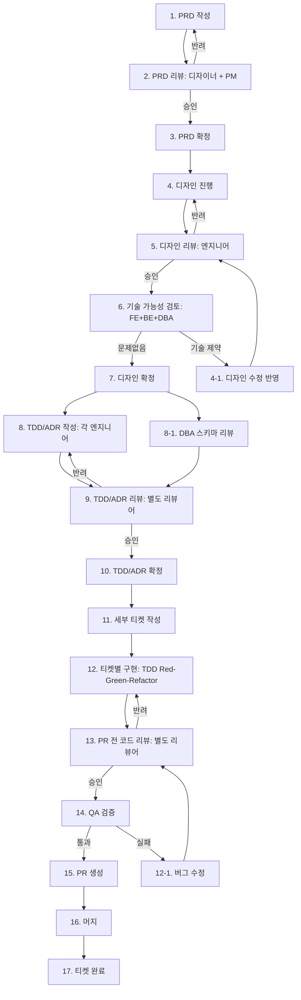

# Rental Commerce 작업 파이프라인

> 모든 기능 개발은 이 파이프라인을 따라야 한다.
> 각 단계는 별도 리뷰어 에이전트가 검증하며, 반려 시 해당 단계로만 롤백한다.

## 파이프라인 전체 흐름



## 단계별 상세

### Phase 1: PRD (PM/PO)

| 단계 | 담당 | 산출물 | 리뷰어 |
|------|------|--------|--------|
| 1. PRD 작성 | PM/PO | PRD 문서 (노션) | - |
| 2. PRD 리뷰 | 디자이너 + PM 리뷰어 에이전트 | 리뷰 코멘트 | 디자이너/PM 에이전트 |
| 3. PRD 확정 | PM/PO | 확정 PRD | - |

**반려 시**: PRD 수정 → 2번으로 재진입 (디자인/TDD로 넘어가지 않음)

### Phase 2: 디자인 (Designer)

| 단계 | 담당 | 산출물 | 리뷰어 |
|------|------|--------|--------|
| 4. 디자인 진행 | 디자이너 | 와이어프레임, 프로토타입 | - |
| 5. 디자인 리뷰 | 엔지니어 리뷰어 에이전트 | 기술 관점 피드백 | FE/BE 에이전트 |
| 6. 기술 가능성 검토 | FE + BE + DBA | 기술 제약 리포트 | - |
| 7. 디자인 확정 | PM/PO + 디자이너 | 확정 디자인 | - |

**반려 시**: 디자인 수정 → 5번으로 재진입 (PRD로 돌아가지 않음)
**기술 제약 발견 시**: 디자인 수정 반영 → 5번으로 재진입

### Phase 3: 기술 설계 (Engineers)

| 단계 | 담당 | 산출물 | 리뷰어 |
|------|------|--------|--------|
| 8. TDD/ADR 작성 | 각 엔지니어 (FE/BE/DevOps) | TDD 문서, ADR 문서 | - |
| 8-1. DBA 스키마 리뷰 | DBA | ERD/스키마 리뷰 코멘트 | DBA 에이전트 |
| 9. TDD/ADR 리뷰 | 별도 리뷰어 에이전트 | 기술 설계 리뷰 | 아키텍트 에이전트 |
| 10. TDD/ADR 확정 | 리드 엔지니어 | 확정 설계 | - |

**반려 시**: TDD/ADR 수정 → 9번으로 재진입 (디자인으로 돌아가지 않음)
**DBA 리뷰**: TDD/ADR 리뷰와 병렬 진행. 스키마 이슈 발견 시 TDD 수정에 반영

### Phase 4: 구현 (Engineers)

| 단계 | 담당 | 산출물 | 리뷰어 |
|------|------|--------|--------|
| 11. 세부 티켓 작성 | 리드 엔지니어 | 노션 티켓 (개요+작업+TC) | - |
| 12. 티켓별 구현 | 담당 엔지니어 | 코드 + 테스트 | - |
| 13. PR 전 코드 리뷰 | 별도 리뷰어 에이전트 | 코드 리뷰 피드백 | 코드 리뷰 에이전트 |
| 14. QA 검증 | QA 에이전트 | 테스트 결과 리포트 | QA 에이전트 |
| 15. PR 생성 | 담당 엔지니어 | GitHub PR | - |
| 16. 머지 | 리드 엔지니어 | main 반영 | - |
| 17. 티켓 완료 | 자동 | 노션 티켓 Done | - |

**코드 리뷰 반려 시**: 코드 수정 → 13번으로 재진입
**QA 실패 시**: 버그 수정 → 13번으로 재진입 (코드 리뷰부터 다시)

## 리뷰어 에이전트 목록

| 에이전트 | 역할 | 사용 단계 |
|---------|------|----------|
| PRD 리뷰어 | PRD 완성도, 유저 스토리, AC 검증 | Phase 1: 2번 |
| 디자인 리뷰어 | UI/UX 기술 구현 가능성 검증 | Phase 2: 5번 |
| DBA 리뷰어 | ERD, 스키마, 인덱스, 쿼리 최적화 | Phase 3: 8-1번 |
| 아키텍트 리뷰어 | TDD/ADR 기술 설계 검증 | Phase 3: 9번 |
| 코드 리뷰어 | 코드 품질, 컨벤션, 보안 | Phase 4: 13번 |
| QA 검증자 | 테스트 케이스 실행, 엣지 케이스 확인 | Phase 4: 14번 |

## 롤백 규칙

```
각 리뷰 반려 시 → 해당 단계로만 롤백 (상위 단계로 거슬러 올라가지 않음)

PRD 리뷰 반려      → PRD 작성으로 (1번)
디자인 리뷰 반려    → 디자인 진행으로 (4번)
기술 가능성 제약    → 디자인 수정으로 (4-1번)
TDD/ADR 리뷰 반려  → TDD/ADR 작성으로 (8번)
코드 리뷰 반려     → 구현으로 (12번)
QA 실패           → 구현으로 (12번), 코드 리뷰 재진행

예외: 구조적 문제 발견 시 (드물게)
  디자인 리뷰에서 PRD 자체 결함 → PM과 합의 후 PRD 수정
  TDD 리뷰에서 디자인 결함 → 디자이너와 합의 후 디자인 수정
  → 이 경우 관련 담당자 간 합의 후 진행, 자동 롤백하지 않음
```
