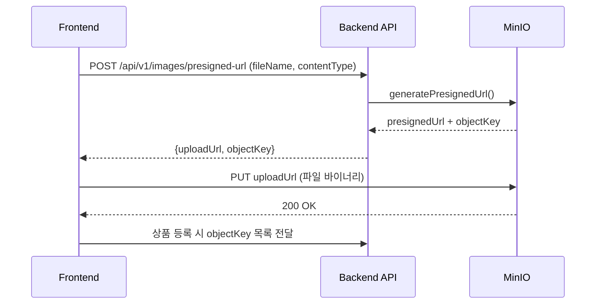
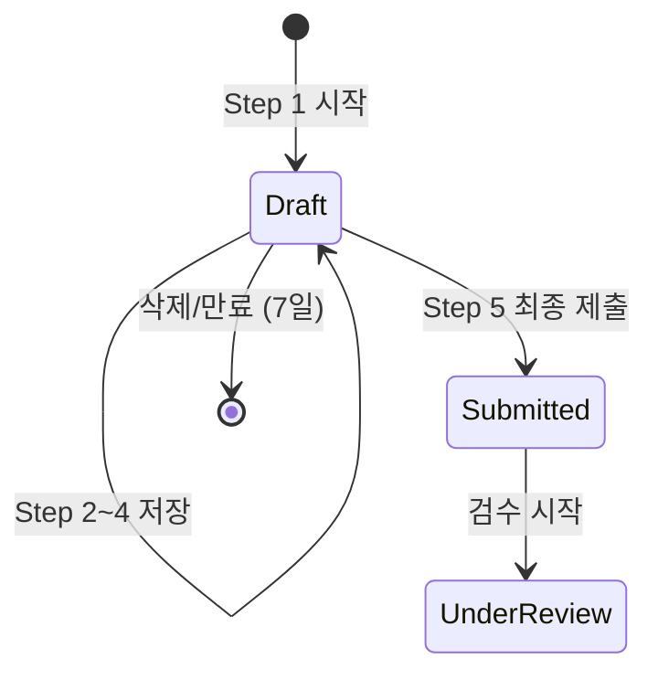
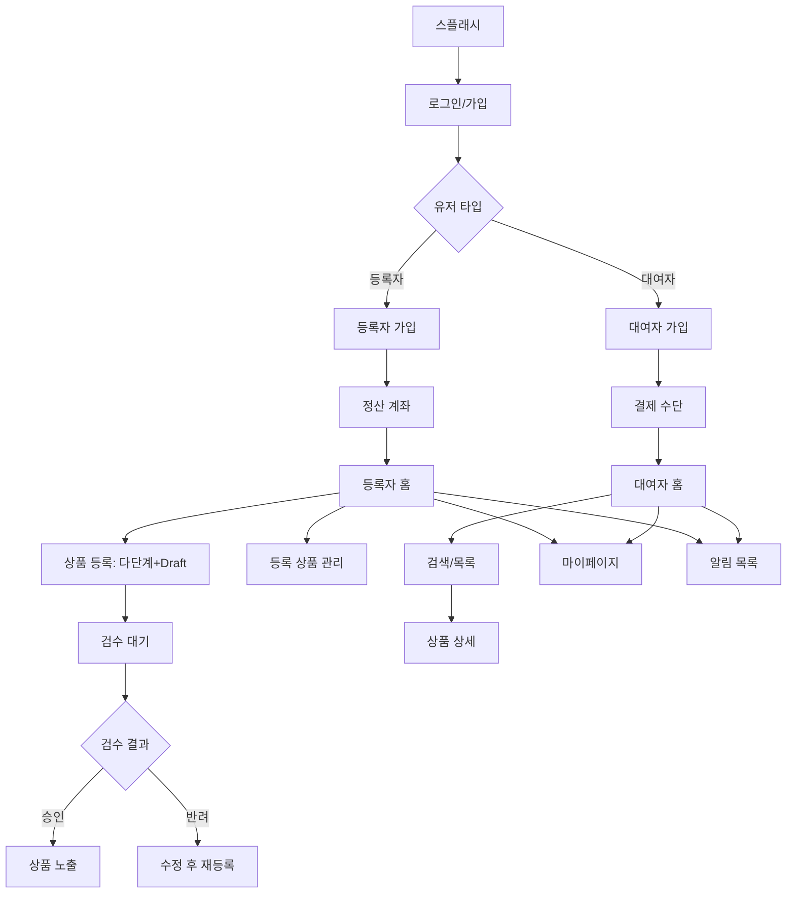

# Sprint 1 화면 구성 (v1.1 — 디자인 리뷰 반영)

> PRD v1.1 확정 기준. 디자인 리뷰 피드백 반영 완료.

## 설계 원칙

- **이미지 업로드**: MinIO Presigned URL 방식. FE → MinIO 직접 업로드 → URL만 BE에 전달
- **상품 등록**: 다단계 폼 + 임시저장(Draft). 이탈 시 데이터 유실 방지
- **인증**: 소셜 로그인 시 전화번호 보유하면 휴대폰 인증 스킵
- **플랫폼 분기**: 사진 갤러리, 가격 계산기는 모바일/웹 컴포넌트 분기

## 화면 목록

### 공통
- 스플래시 / 온보딩
- 로그인 (이메일/소셜)
- 가입 유형 선택 (등록자/대여자)
- **마이페이지** (프로필 조회/수정, 비밀번호 변경)
- **알림 목록** (검수 결과, 대여 상태, 시스템 알림)

### 등록자 (개인)
- 등록자 가입 폼 (이름, 이메일, 휴대폰 인증)
  - 소셜 로그인 시 전화번호 존재하면 휴대폰 인증 스킵
- 정산 계좌 등록
- 등록자 홈 (대시보드: 상품 현황, 대여 현황)
- **등록 상품 관리** (전체 상품 목록, 상태별 필터, 수정/삭제)
- 상품 등록 폼 (다단계 + 임시저장)
  - Step 1: 카테고리 선택
  - Step 2: 상품 정보 입력 (이름, 설명, 상태)
  - Step 3: 사진 업로드 (Presigned URL, 최소 3장, 드래그 정렬)
  - Step 4: 대여 단위 (연/월/일) + 가격 설정 + 가이드 가격 표시
  - Step 5: 보증금 설정 (선택) + 최종 확인 → 제출
  - ※ 각 Step 완료 시 Draft 자동 저장, 이탈 후 이어서 작성 가능
- 상품 상세 (등록자 뷰 — 상태, 수정, 삭제)
- 검수 결과 확인 (승인/반려 + 사유)

### 대여자
- 대여자 가입 폼 (이름, 이메일, 휴대폰 인증)
  - 소셜 로그인 시 전화번호 존재하면 휴대폰 인증 스킵
- 결제 수단 등록
- 대여자 홈 (추천 상품, 카테고리)
- 상품 검색/목록
  - 카테고리 필터
  - 가격 범위 필터
  - 대여 단위 필터
  - 정렬 (인기순, 가격순, 최신순)
- 상품 상세 (대여자 뷰)
  - 사진 갤러리 (모바일: 스와이프, 웹: 썸네일 그리드)
  - 상품 정보
  - 등록자 정보 + 등급
  - 가격 + 보증금 + 수수료 계산기 (모바일: 바텀시트, 웹: 사이드패널)
  - 대여 신청 버튼

### 관리자 (MVP 최소)
- 상품 검수 대기 목록
- 검수 상세 (사진 확인 → 승인/반려)

## 이미지 업로드 플로우

## 상품 등록 임시저장 플로우

## 화면 흐름 (Sprint 1)

## 플랫폼별 컴포넌트 분기

| 컴포넌트 | 모바일 | 웹 |
|---------|--------|-----|
| 사진 갤러리 | 좌우 스와이프 + 인디케이터 | 썸네일 그리드 + 메인 이미지 |
| 가격 계산기 | 바텀시트 (기간 선택 → 비용 계산) | 사이드 패널 (항상 노출) |
| 사진 업로드 | 카메라/갤러리 선택 | 드래그앤드롭 + 파일 선택 |
| 상품 등록 | 단계별 풀스크린 | 좌우 분할 (입력 + 미리보기) |
