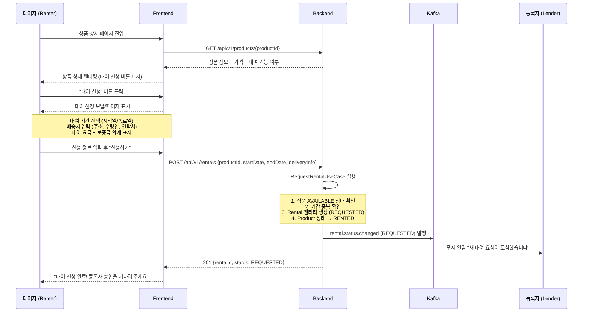
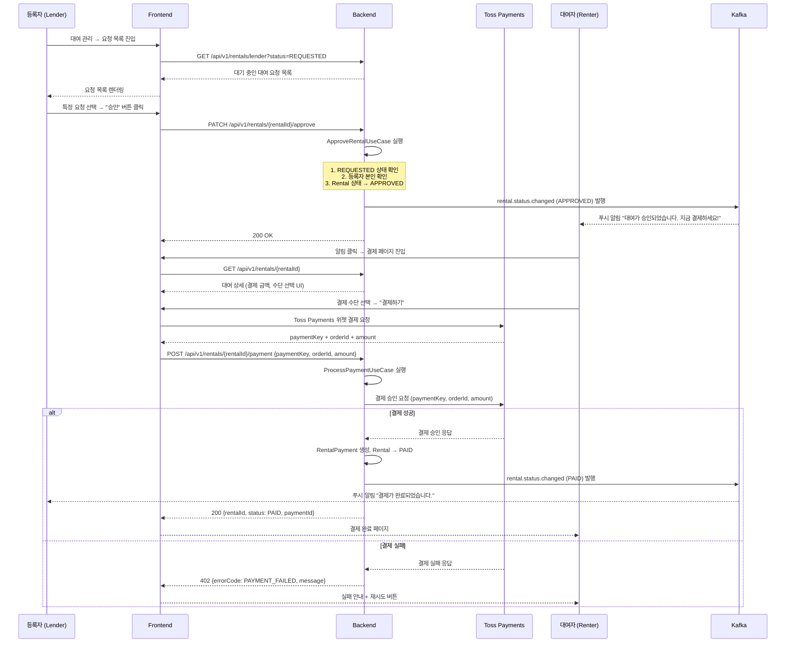
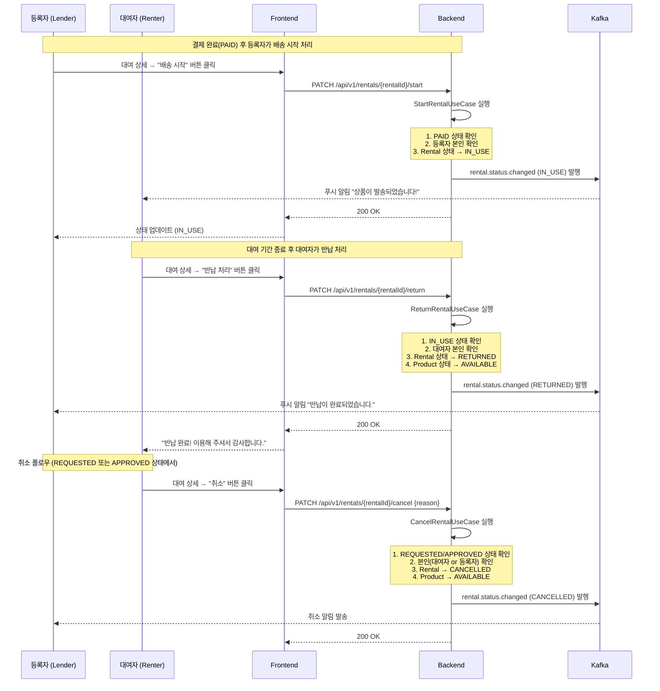

# PRD-002: Sprint 2 — 대여/결제 핵심 플로우

- **Status**: Draft v1.0
- **Date**: 2026-04-14
- **Sprint**: 2
- **PM/PO**: Product Team
- **Related TDD**: TDD-002-sprint2-rental-payment.md
- **Related ADR**: ADR-005 (결제 Gateway 추상화), ADR-006 (대여 상태 전이)

---

## 1. 제품 목표 (Product Goal)

### 1.1 비전

> "등록자와 대여자 모두가 신뢰할 수 있는 대여 거래를 완성한다."

Sprint 1에서 구축한 회원/상품 MVP 위에, 실제 대여 거래가 처음부터 끝까지 완료될 수 있는 핵심 플로우를 제공한다. 대여 신청 → 승인 → 결제 → 대여 중 → 반납의 생애주기 전체를 앱 안에서 처리한다.

### 1.2 핵심 가설

| # | 가설 | 검증 지표 |
|---|------|----------|
| H1 | 대여 신청 UX가 단순하면 전환율이 높아진다 | 상품 상세 → 신청 완료 전환율 ≥ 40% |
| H2 | 실시간 알림(Kafka)이 승인 응답 시간을 단축한다 | 등록자 평균 승인 시간 ≤ 24시간 |
| H3 | 인앱 결제(Toss Payments)가 이탈을 줄인다 | 결제 페이지 → 결제 완료 전환율 ≥ 70% |
| H4 | 상태 타임라인 제공 시 고객 문의가 감소한다 | CS 인입 건수 주 5건 이하 (런칭 2주 기준) |

### 1.3 Sprint 2 목표

1. 대여자가 앱 내에서 상품 대여 신청을 완료할 수 있다.
2. 등록자가 대여 요청을 승인/거절할 수 있다.
3. 승인된 대여에 대해 Toss Payments 결제를 완료할 수 있다.
4. 대여 상태(REQUESTED → APPROVED → PAID → IN_USE → RETURNED)가 실시간으로 양쪽 당사자에게 표시된다.
5. 대여자/등록자 양쪽의 대여 히스토리 목록을 제공한다.

---

## 2. 용어 정의 (Terminology)

| 용어 | 설명 |
|------|------|
| Rental | 대여 트랜잭션 — 대여자와 등록자 간 대여 계약 단위 |
| RentalStatus | 대여 상태: REQUESTED → APPROVED → PAID → IN_USE → RETURNED / CANCELLED |
| RentalPayment | 대여에 연결된 결제 레코드 (결제금액, 수단, 외부 PG ID) |
| DeliveryInfo | 배송 수령지 VO (주소, 수령인, 연락처) |
| Lender | 상품 등록자 (공급자) |
| Renter | 상품 대여자 (수요자) |
| PG | Payment Gateway — 외부 결제사 (Toss Payments) |
| 대여 기간 | 대여자가 신청 시 지정한 시작일~종료일 |
| 보증금 | 대여 시 선납하는 담보금 (반납 후 환불) |

---

## 3. 유저 스토리 (User Stories)

### 3.1 대여자 (Renter) 스토리

| ID | As a | I want to | So that | 우선순위 |
|----|------|-----------|---------|---------|
| US-R01 | 대여자 | 상품 상세에서 대여 기간과 배송지를 입력하여 신청할 수 있다 | 원하는 날짜에 상품을 대여할 수 있다 | P0 |
| US-R02 | 대여자 | 등록자의 승인 후 결제 페이지로 이동하여 결제를 완료할 수 있다 | 대여가 확정된다 | P0 |
| US-R03 | 대여자 | 내 대여 목록에서 진행 중인 모든 대여의 상태를 확인할 수 있다 | 대여 현황을 한눈에 파악할 수 있다 | P0 |
| US-R04 | 대여자 | 대여 상세 페이지에서 상태 타임라인을 볼 수 있다 | 현재 어느 단계인지 명확히 알 수 있다 | P1 |
| US-R05 | 대여자 | 결제 전(APPROVED 이전) 대여를 취소할 수 있다 | 마음이 바뀌었을 때 취소할 수 있다 | P1 |
| US-R06 | 대여자 | 반납 처리를 앱에서 할 수 있다 | 반납 완료를 시스템에 기록할 수 있다 | P1 |
| US-R07 | 대여자 | 결제 실패 시 재시도를 할 수 있다 | 일시적 오류로 결제가 안 될 때 다시 시도한다 | P2 |

### 3.2 등록자 (Lender) 스토리

| ID | As a | I want to | So that | 우선순위 |
|----|------|-----------|---------|---------|
| US-L01 | 등록자 | 들어온 대여 요청 목록을 확인할 수 있다 | 대여 요청을 놓치지 않는다 | P0 |
| US-L02 | 등록자 | 대여 요청을 승인하거나 거절할 수 있다 | 원하는 대여자에게만 빌려줄 수 있다 | P0 |
| US-L03 | 등록자 | 승인한 대여에 대해 배송 시작 처리를 할 수 있다 | 대여자에게 배송 시작을 알릴 수 있다 | P1 |
| US-L04 | 등록자 | 등록한 상품의 전체 대여 히스토리를 볼 수 있다 | 상품 회전율을 파악하고 관리할 수 있다 | P2 |
| US-L05 | 등록자 | 반납이 완료된 대여에 대해 수익 정산 현황을 볼 수 있다 | 얼마를 벌었는지 확인할 수 있다 | P3 |

### 3.3 관리자 (Admin) 스토리

| ID | As a | I want to | So that | 우선순위 |
|----|------|-----------|---------|---------|
| US-A01 | 관리자 | 전체 대여 목록을 상태별로 필터링하여 볼 수 있다 | 이상 거래를 모니터링할 수 있다 | P2 |
| US-A02 | 관리자 | 특정 대여를 강제 취소할 수 있다 | 분쟁이나 정책 위반 시 조치할 수 있다 | P2 |
| US-A03 | 관리자 | 결제 내역을 확인하고 환불 처리를 할 수 있다 | CS 분쟁을 해결할 수 있다 | P3 |

---

## 4. 유저 플로우 (User Flows)

### 4.1 대여 신청 플로우



### 4.2 승인 및 결제 플로우



### 4.3 대여 시작 및 반납 플로우



---

## 5. 화면별 상세 명세 (Screen Specification)

### 5.1 대여 신청 페이지 (`/products/{productId}/rental-request`)

**진입 경로**: 상품 상세 페이지 → "대여 신청" CTA 버튼

**화면 구성 (wireframe)**:
```
┌─────────────────────────────────────────┐
│  ← 뒤로가기           대여 신청          │
├─────────────────────────────────────────┤
│  [상품 썸네일 (80px)] 상품명             │
│                       카테고리 · 상태    │
├─────────────────────────────────────────┤
│  대여 기간                               │
│  ┌────────────────────────────────────┐ │
│  │ 시작일: [날짜 선택 캘린더] YYYY-MM-DD│ │
│  │ 종료일: [날짜 선택 캘린더] YYYY-MM-DD│ │
│  │ 기간: X일                          │ │
│  └────────────────────────────────────┘ │
├─────────────────────────────────────────┤
│  배송지 정보                             │
│  수령인: [텍스트 입력]                   │
│  연락처: [전화번호 입력]                 │
│  주소: [주소 검색 버튼]                  │
│  상세주소: [텍스트 입력]                 │
├─────────────────────────────────────────┤
│  요금 요약                               │
│  ┌────────────────────────────────────┐ │
│  │ 대여료: X원/일 × X일 = X,XXX원    │ │
│  │ 보증금: X,XXX원                    │ │
│  │ ──────────────────────────────     │ │
│  │ 결제 예정: XX,XXX원                │ │
│  └────────────────────────────────────┘ │
├─────────────────────────────────────────┤
│  [신청하기 - Primary CTA]               │
└─────────────────────────────────────────┘
```

**입력 유효성 검증**:
- 시작일 ≥ 오늘 + 1일
- 종료일 > 시작일
- 수령인: 2~20자
- 연락처: 010-XXXX-XXXX 형식
- 주소: 필수 입력

**에러 케이스**:
- 이미 대여 신청된 기간: "해당 기간은 이미 대여 요청이 있습니다"
- 상품 AVAILABLE 아님: "현재 대여 신청 불가한 상품입니다"

---

### 5.2 결제 페이지 (`/rentals/{rentalId}/payment`)

**진입 조건**: `RentalStatus = APPROVED`인 경우에만 접근 가능

**화면 구성**:
```
┌─────────────────────────────────────────┐
│  ← 뒤로가기             결제            │
├─────────────────────────────────────────┤
│  주문 정보                               │
│  ┌────────────────────────────────────┐ │
│  │ 상품명: OOO                        │ │
│  │ 대여 기간: YYYY-MM-DD ~ YYYY-MM-DD │ │
│  │ 배송지: 서울시 OO구 OO로...        │ │
│  └────────────────────────────────────┘ │
├─────────────────────────────────────────┤
│  Toss Payments 결제 위젯                 │
│  ┌────────────────────────────────────┐ │
│  │  카드 / 계좌이체 / 토스페이        │ │
│  │  [Toss Payments Widget iframe]     │ │
│  └────────────────────────────────────┘ │
├─────────────────────────────────────────┤
│  최종 결제 금액                          │
│  ┌────────────────────────────────────┐ │
│  │ 대여료: XX,XXX원                   │ │
│  │ 보증금: XX,XXX원                   │ │
│  │ ───────────────────────────────    │ │
│  │ 합계: XX,XXX원                     │ │
│  └────────────────────────────────────┘ │
├─────────────────────────────────────────┤
│  [결제하기 XX,XXX원 - Primary CTA]      │
└─────────────────────────────────────────┘
```

**결제 성공**: `/rentals/{rentalId}/payment/success` 리다이렉트
**결제 실패**: 실패 팝업 + 재시도 버튼

---

### 5.3 내 대여 목록 (`/my/rentals`)

**탭 구성**: `대여 중` / `완료` / `취소됨`
**섹션**: 대여자로서의 대여 / 등록자로서의 대여 (토글)

**목록 카드 구성**:
```
┌─────────────────────────────────────────┐
│ [상품 이미지 60px]  상품명              │
│                     YYYY-MM-DD ~ MM-DD  │
│                     [상태 뱃지: IN_USE] │
│                     XX,XXX원            │
└─────────────────────────────────────────┘
```

**상태 뱃지 색상**:
- REQUESTED: 회색 (대기 중)
- APPROVED: 파란색 (승인됨)
- PAID: 초록색 (결제 완료)
- IN_USE: 주황색 (대여 중)
- RETURNED: 진한 회색 (반납 완료)
- CANCELLED: 빨간색 (취소됨)

**정렬**: 최신 순 (기본), 날짜 오래된 순

---

### 5.4 대여 상세 페이지 (`/rentals/{rentalId}`)

**화면 구성**:
```
┌─────────────────────────────────────────┐
│  ← 뒤로가기           대여 상세          │
├─────────────────────────────────────────┤
│  [상태 타임라인]                         │
│  ●── 신청 ──●── 승인 ──○── 결제 ──○── 대여중 ──○── 반납
│  YYYY-MM-DD HH:mm                        │
├─────────────────────────────────────────┤
│  상품 정보                               │
│  [이미지] 상품명 / 카테고리              │
├─────────────────────────────────────────┤
│  대여 정보                               │
│  기간: YYYY-MM-DD ~ YYYY-MM-DD (X일)    │
│  배송지: OO시 OO구 OO로...              │
│  수령인: 홍길동 / 010-XXXX-XXXX         │
├─────────────────────────────────────────┤
│  결제 정보 (PAID 이후 표시)             │
│  결제 금액: XX,XXX원                     │
│  결제 수단: 카드 (토스뱅크)             │
│  결제일: YYYY-MM-DD HH:mm              │
├─────────────────────────────────────────┤
│  [상태별 액션 버튼]                      │
│  APPROVED일 때: [결제하기] (대여자)      │
│  PAID일 때: [배송 시작] (등록자)         │
│  IN_USE일 때: [반납 처리] (대여자)       │
│  REQUESTED/APPROVED: [취소하기]          │
└─────────────────────────────────────────┘
```

---

### 5.5 등록자 대여 관리 (`/my/rentals/lender`)

**화면 구성**:
```
┌─────────────────────────────────────────┐
│  대여 요청 관리                          │
├─────────────────────────────────────────┤
│  [필터 탭] 전체 | 대기중 | 진행중 | 완료│
├─────────────────────────────────────────┤
│  ┌───────────────────────────────────┐  │
│  │ [상품 이미지] 상품명              │  │
│  │             대여자: 홍길동        │  │
│  │             기간: MM-DD ~ MM-DD   │  │
│  │             XX,XXX원              │  │
│  │  [거절] [승인]  ← REQUESTED일 때  │  │
│  └───────────────────────────────────┘  │
└─────────────────────────────────────────┘
```

**거절 모달**: 거절 사유 입력 (필수, 최소 10자)
**승인 처리**: 즉시 처리, 대여자에게 알림 발송

---

## 6. 비기능 요구사항 (Non-Functional Requirements)

### 6.1 동시 대여 요청 처리 (Concurrency)

**문제**: 동일 상품에 동시에 여러 대여 요청이 들어올 경우, 하나만 처리되어야 한다.

**해결책**:
- 데이터베이스 수준: `product.status`에 낙관적 락(Optimistic Lock, `@Version`) 적용
- 동일 상품에 REQUESTED/APPROVED/PAID/IN_USE 상태 대여가 이미 존재하면 신규 신청 차단
- 요청 처리 시 Product 상태를 `RENTED`로 즉시 업데이트하여 중복 신청 방지
- 충돌 발생 시: `409 Conflict` + `RENTAL_CONFLICT` 에러코드 반환

**SLA**: 동시 1,000 req/s 환경에서도 중복 대여 0건 보장

### 6.2 결제 멱등성 (Payment Idempotency)

**문제**: 네트워크 오류로 결제 요청이 중복 전송될 수 있다.

**해결책**:
- 각 대여(Rental)마다 고유 `orderId` 생성 (UUID 기반): `RC-{rentalId}-{timestamp}`
- Toss Payments의 `orderId` 멱등성 보장 활용
- `rental_payment` 테이블에 `external_payment_id` UNIQUE 제약 → DB 레벨 중복 차단
- 결제 상태가 이미 `PAID`인 경우: `200 OK` + 기존 결제 정보 반환 (재처리 없이)
- 미결제 상태에서만 `ProcessPaymentUseCase` 실행 허용

### 6.3 상태 전이 무결성 (State Transition Integrity)

**규칙**:
```
REQUESTED  → APPROVED (등록자 승인)
REQUESTED  → CANCELLED (대여자/등록자 취소)
APPROVED   → PAID (결제 완료)
APPROVED   → CANCELLED (대여자/등록자 취소)
PAID       → IN_USE (등록자 배송 시작)
IN_USE     → RETURNED (대여자 반납)
```

**보장 방법**:
- `Rental` 도메인 엔티티 내부에 전이 검증 로직 캡슐화
- 허용되지 않은 전이 시 `IllegalStateException` → 도메인 계층에서 차단
- 동일 상태 재요청 시 (APPROVED 상태에서 approve()): 멱등 처리 (에러 없이 현재 상태 반환)

### 6.4 성능 요구사항

| 항목 | 목표 |
|------|------|
| 대여 신청 API 응답 시간 | p95 ≤ 200ms |
| 결제 처리 API 응답 시간 | p95 ≤ 3,000ms (Toss 외부 호출 포함) |
| 내 대여 목록 API | p95 ≤ 150ms (최대 100건 기준) |
| Kafka 이벤트 발행 지연 | ≤ 500ms |
| 동시 사용자 | 500 CCU 환경에서 에러율 ≤ 0.1% |

### 6.5 보안 요구사항

- 모든 대여 관련 API는 JWT 인증 필수
- 대여 상세/취소/승인은 당사자(대여자/등록자)만 접근 가능
- 결제 금액 서버사이드 재검증 필수 (FE에서 전달된 금액과 DB 계산 금액 일치 확인)
- Toss Payments 시크릿 키는 환경 변수로 관리, 코드에 노출 금지

---

## 7. 성공 지표 (KPI)

### 7.1 비즈니스 지표

| KPI | 목표값 | 측정 방법 |
|-----|--------|----------|
| 대여 신청 완료율 | ≥ 40% (상품 상세 진입 대비) | GA 퍼널 분석 |
| 등록자 승인율 | ≥ 80% | `APPROVED / REQUESTED` 비율 |
| 결제 전환율 | ≥ 70% (승인 후 결제 완료) | `PAID / APPROVED` 비율 |
| 반납 완료율 | ≥ 95% (대여 중 → 반납) | `RETURNED / IN_USE` 비율 |
| 평균 승인 대기 시간 | ≤ 24시간 | `approved_at - created_at` 평균 |

### 7.2 기술 지표

| KPI | 목표값 |
|-----|--------|
| 결제 중복 처리 건수 | 0건/월 |
| 상태 전이 오류 건수 | 0건/월 |
| 결제 API 가용성 | ≥ 99.5% |
| 알림 발송 실패율 | ≤ 0.5% |

---

## 8. 릴리즈 기준 (Release Criteria)

### 8.1 필수 조건 (P0 — 릴리즈 차단)

- [ ] 대여 신청 → 승인 → 결제 → 대여 중 → 반납 엔드-투-엔드 플로우 E2E 테스트 통과
- [ ] 결제 중복 처리 방지 검증 (멱등성 테스트)
- [ ] 동시 대여 신청 동시성 테스트 통과 (k6 부하 테스트 500 VU)
- [ ] 상태 전이 불법 케이스 400 에러 반환 확인
- [ ] 등록자 본인 확인 (타인 승인/거절 불가) 확인
- [ ] Toss Payments 결제 성공/실패 케이스 QA 완료

### 8.2 권장 조건 (P1 — 릴리즈 후 1주 내)

- [ ] 대여 취소 플로우 QA 완료
- [ ] 상태 타임라인 UI 표시 확인
- [ ] Kafka 알림 발송 E2E 검증

### 8.3 제외 범위 (Out of Scope — Sprint 3 이후)

- 보증금 환불 자동화 (스크립트 수동 처리)
- 분쟁 조정 시스템
- 상품 후기/평점
- 정기 구독 결제
- 분할 결제

---

## 9. 의존성 및 전제 조건

| 항목 | 내용 |
|------|------|
| Sprint 1 완료 | User, Product, Inspect, 알림 MVP |
| Toss Payments 연동 | 테스트 키 발급 완료 필요 |
| Kafka 클러스터 | Docker Compose 로컬 + 스테이징 준비 |
| SMS/Push 알림 | Sprint 1에서 구축된 NotificationService 재사용 |

---

## Document History

| 날짜 | 버전 | 변경 내용 |
|------|------|----------|
| 2026-04-14 | 1.0 | 초안 작성 — Sprint 2 대여/결제 플로우 |
