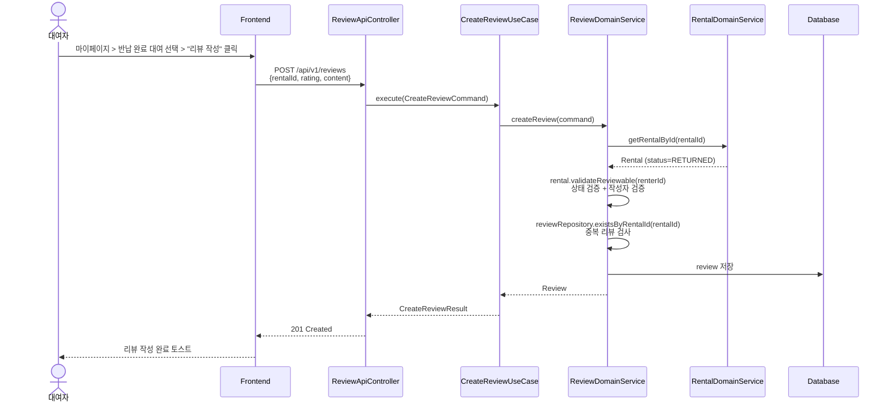
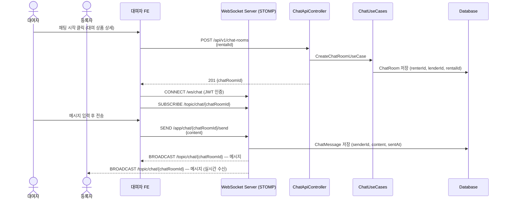
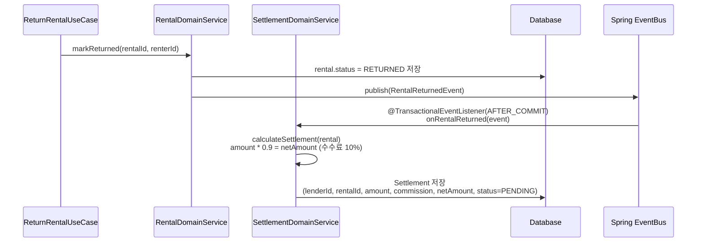
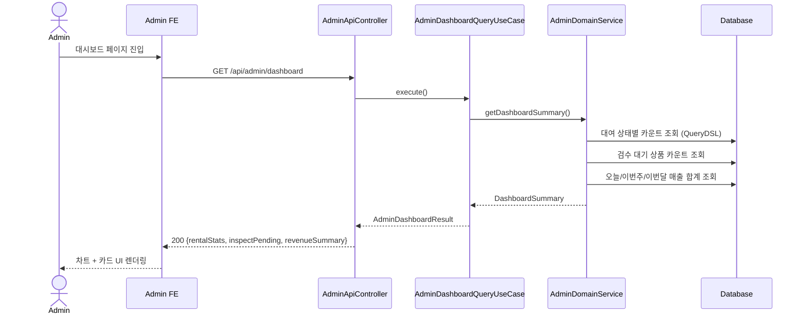

# PRD-003: Sprint 3 — 리뷰/평점, 채팅, 관리자 대시보드, 결제 정산

- **Status**: Draft v1.0
- **Date**: 2026-04-14
- **Sprint**: 3
- **PM/PO**: Product Team
- **Related TDD**: TDD-003-sprint3-review-chat-admin.md
- **Related ADR**: ADR-007 (WebSocket 채팅 아키텍처), ADR-008 (정산 자동화 전략)

---

## 1. 제품 목표 (Product Goal)

### 1.1 비전

> "대여 완료 이후의 신뢰 루프를 완성한다 — 리뷰로 신뢰를 쌓고, 채팅으로 소통하며, 정산으로 가치를 돌려받는다."

Sprint 2에서 완성된 대여/결제 핵심 플로우 위에, 플랫폼 신뢰도를 높이는 리뷰/평점, 대여 당사자 간 실시간 채팅, 운영 효율을 위한 관리자 대시보드, 등록자 수익 정산 기능을 구현한다.

### 1.2 핵심 가설

| # | 가설 | 검증 지표 |
|---|------|----------|
| H1 | 리뷰/평점 시스템이 재대여 전환율을 높인다 | 리뷰가 있는 상품의 재대여 전환율 ≥ 미리뷰 상품 대비 30% 향상 |
| H2 | 실시간 채팅이 대여 성사율을 높인다 | 채팅 시작 → 대여 신청 전환율 ≥ 50% |
| H3 | 투명한 정산 내역이 등록자 이탈률을 낮춘다 | 정산 내역 조회 후 상품 재등록율 ≥ 70% |
| H4 | 관리자 대시보드가 운영 대응 속도를 개선한다 | 검수 대기 상품 처리 시간 ≤ 24시간 (기존 48시간 → 50% 개선) |

### 1.3 Sprint 3 목표

1. 대여 완료(RETURNED) 상태에서만 리뷰 작성이 가능하고, 중복 리뷰가 방지된다.
2. 대여 당사자(대여자/등록자)가 실시간으로 채팅할 수 있다.
3. 관리자가 대시보드에서 전체 운영 현황을 한눈에 파악하고 관리할 수 있다.
4. 대여 완료 시 자동으로 정산이 생성되고, 등록자가 정산 내역을 조회할 수 있다.

---

## 2. 용어 정의 (Terminology)

| 용어 | 설명 |
|------|------|
| Review | 대여 완료 후 대여자가 남기는 상품/거래 평가 (rating 1~5 + content) |
| ChatRoom | 대여 건(rentalId)에 연결된 대여자-등록자 간 1:1 채팅방 |
| ChatMessage | 채팅방에 발송된 단일 메시지 |
| WebSocket (STOMP) | 실시간 양방향 통신 프로토콜 — 채팅에 사용 |
| Settlement | 대여 완료 후 등록자에게 지급되는 정산 레코드 |
| Commission | 플랫폼 수수료 (대여금액의 10%) |
| NetAmount | 정산 금액 = 대여금액 - 수수료 |
| AdminDashboard | 관리자 전용 운영 현황 통합 뷰 |
| RETURNED | 대여 상태 — 반납 완료. 리뷰 작성 및 정산 생성의 트리거 상태 |

---

## 3. 유저 스토리 (User Stories)

### 3.1 대여자 (Renter) 스토리

| ID | As a | I want to | So that | 우선순위 |
|----|------|-----------|---------|---------|
| US-R01 | 대여자 | 반납 완료된 대여에 대해 별점과 한 줄 리뷰를 남길 수 있다 | 다른 대여자들에게 신뢰할 수 있는 후기를 제공할 수 있다 | P0 |
| US-R02 | 대여자 | 내가 작성한 리뷰 목록을 마이페이지에서 확인할 수 있다 | 내가 남긴 평가 이력을 관리할 수 있다 | P1 |
| US-R03 | 대여자 | 대여 협의를 위해 등록자에게 채팅 메시지를 보낼 수 있다 | 대여 전 조건을 직접 협의할 수 있다 | P0 |
| US-R04 | 대여자 | 내 채팅 목록에서 모든 채팅방을 확인할 수 있다 | 진행 중인 대화를 놓치지 않는다 | P1 |
| US-R05 | 대여자 | 상품 상세 페이지에서 해당 상품의 리뷰 목록과 평균 평점을 볼 수 있다 | 대여 전 신뢰도를 확인하고 결정할 수 있다 | P0 |

### 3.2 등록자 (Lender) 스토리

| ID | As a | I want to | So that | 우선순위 |
|----|------|-----------|---------|---------|
| US-L01 | 등록자 | 대여 완료 시 정산 내역이 자동으로 생성되는 것을 확인할 수 있다 | 별도 신청 없이 수익을 정산받을 수 있다 | P0 |
| US-L02 | 등록자 | 마이페이지에서 정산 내역(대여금액, 수수료, 실수령액)을 조회할 수 있다 | 얼마를 벌었는지 투명하게 확인할 수 있다 | P0 |
| US-L03 | 등록자 | 대여자로부터 채팅 메시지를 수신하고 답장할 수 있다 | 대여 조건을 사전 협의하고 더 많은 대여를 성사시킬 수 있다 | P0 |
| US-L04 | 등록자 | 내 상품에 달린 리뷰와 평점을 확인할 수 있다 | 상품 서비스를 개선할 수 있다 | P1 |

### 3.3 관리자 (Admin) 스토리

| ID | As a | I want to | So that | 우선순위 |
|----|------|-----------|---------|---------|
| US-A01 | 관리자 | 전체 대여 현황(상태별 카운트)을 대시보드에서 한눈에 볼 수 있다 | 플랫폼 운영 상태를 신속히 파악할 수 있다 | P0 |
| US-A02 | 관리자 | 검수 대기 중인 상품 목록을 확인하고 승인/거절 처리를 할 수 있다 | 상품 등록 지연 없이 신속히 처리할 수 있다 | P0 |
| US-A03 | 관리자 | 일별/주별/월별 매출 통계를 차트로 볼 수 있다 | 매출 추이를 파악하고 비즈니스 의사결정을 할 수 있다 | P0 |
| US-A04 | 관리자 | 특정 사용자를 정지(suspend)하거나 정지를 해제할 수 있다 | 악성 사용자를 신속히 차단하여 플랫폼 안전을 유지할 수 있다 | P1 |
| US-A05 | 관리자 | 전체 대여 목록을 상태/날짜 필터로 조회할 수 있다 | 특정 기간의 대여 현황을 상세 분석할 수 있다 | P1 |

---

## 4. 시퀀스 다이어그램 (Sequence Diagrams)

### 4.1 리뷰 작성 플로우

### 4.2 실시간 채팅 플로우

### 4.3 정산 자동 생성 플로우

### 4.4 관리자 대시보드 조회 플로우

---

## 5. 화면 명세 (Screen Specifications)

### 5.1 리뷰 작성 화면

| 요소 | 상세 |
|------|------|
| 접근 경로 | 마이페이지 > 대여 내역 > 반납 완료 탭 > "리뷰 작성" 버튼 |
| 별점 선택 | 1~5점 별 아이콘 탭 선택 (기본값 없음, 필수) |
| 리뷰 내용 | 텍스트에어리어 (최소 10자, 최대 500자, 실시간 글자수 표시) |
| 제출 | "리뷰 등록" 버튼 — 별점 미선택 시 비활성화 |
| 완료 후 | 토스트 메시지 + 상품 상세 리뷰 목록으로 이동 |
| 에러 처리 | 이미 리뷰가 존재하면 "이미 리뷰를 작성했습니다" 알림 |

### 5.2 상품 상세 리뷰 목록

| 요소 | 상세 |
|------|------|
| 평균 평점 | 별점 아이콘 + 숫자 (예: ★ 4.3 / 23개 리뷰) |
| 리뷰 카드 | 작성자 닉네임(마스킹), 별점, 내용, 작성일시 |
| 정렬 | 최신순 (기본), 평점 높은 순 |
| 페이지네이션 | 10개 단위, 무한 스크롤 |

### 5.3 채팅 목록 화면

| 요소 | 상세 |
|------|------|
| 접근 경로 | 하단 탭 > "채팅" 아이콘 |
| 채팅방 카드 | 상대방 닉네임, 연결된 상품 썸네일, 마지막 메시지 미리보기, 시간 |
| 읽지 않은 메시지 | 빨간 뱃지로 카운트 표시 |
| 정렬 | 최근 메시지 시간 내림차순 |

### 5.4 채팅방 화면

| 요소 | 상세 |
|------|------|
| 상단 | 상대방 닉네임, 연결 상품명 |
| 메시지 목록 | 내 메시지(우측 파란 말풍선), 상대 메시지(좌측 회색) |
| 입력창 | 텍스트 입력 + 전송 버튼 (최대 1000자) |
| 실시간 | WebSocket STOMP 구독 — 상대방 메시지 즉시 표시 |
| 날짜 구분선 | 날짜가 바뀌면 날짜 구분선 표시 |

### 5.5 관리자 대시보드 화면

| 요소 | 상세 |
|------|------|
| 접근 경로 | /admin (관리자 계정만 접근 — ROLE_ADMIN 체크) |
| 대여 현황 카드 | 상태별 카운트: 신청중/승인됨/결제완료/대여중/반납완료/취소됨 |
| 매출 차트 | 라인 차트 — 일별/주별/월별 탭 전환, X축: 날짜, Y축: 매출액 |
| 검수 대기 테이블 | 상품명, 등록자, 등록일, "검수하기" 링크 |
| 사용자 관리 테이블 | 이름, 이메일, 상태(활성/정지), "정지/해제" 버튼 |

### 5.6 정산 내역 화면

| 요소 | 상세 |
|------|------|
| 접근 경로 | 마이페이지 > "정산 내역" 탭 |
| 정산 카드 | 상품명, 대여 기간, 대여금액, 수수료(10%), 실수령액, 상태 |
| 정산 상태 | PENDING(정산 예정) / COMPLETED(정산 완료) |
| 합계 | 화면 상단 이번달 정산 예정액 + 누계 수령액 표시 |

---

## 6. 비기능 요구사항 (Non-Functional Requirements)

### 6.1 성능

| 항목 | 목표 |
|------|------|
| 리뷰 목록 조회 응답시간 | P95 ≤ 200ms (캐싱 없음 기준) |
| 채팅 메시지 전달 지연 | P95 ≤ 500ms (WebSocket 기준) |
| 관리자 대시보드 초기 로딩 | P95 ≤ 1000ms |
| 정산 자동 생성 지연 | 대여 완료(RETURNED) 이벤트 후 ≤ 5초 내 정산 레코드 생성 |

### 6.2 보안

| 항목 | 요구사항 |
|------|---------|
| 리뷰 작성 권한 | 해당 rentalId의 renterId 본인만 작성 가능 |
| 채팅방 접근 권한 | 해당 채팅방의 renterId 또는 lenderId만 접근 가능 |
| 관리자 API | ROLE_ADMIN 권한 체크 — 일반 사용자 접근 시 403 |
| 정산 조회 권한 | 본인(lenderId) 정산만 조회 가능 |
| XSS 방지 | 리뷰 내용/채팅 메시지 HTML 이스케이프 처리 |

### 6.3 동시성

| 항목 | 대응 방안 |
|------|---------|
| 리뷰 중복 작성 | DB UNIQUE INDEX (rental_id) + 애플리케이션 레벨 중복 검사 |
| 정산 중복 생성 | DB UNIQUE INDEX (rental_id) + 멱등성 보장 |
| WebSocket 메시지 순서 | sentAt(ZonedDateTime) 기반 정렬 보장 |

### 6.4 가용성 및 확장성

| 항목 | 요구사항 |
|------|---------|
| WebSocket 서버 | rental-socket 모듈 독립 배포 (Stateless 세션 지양, Redis Pub/Sub 고려) |
| 정산 배치 | Sprint 3 MVP: 이벤트 기반 즉시 생성 / Sprint 4: 배치 정산으로 개선 |
| 채팅 메시지 저장 | RDB 저장 (MVP) — 대용량 시 NoSQL 마이그레이션 고려 |

---

## 7. 의존성 및 제약사항

| 항목 | 내용 |
|------|------|
| Sprint 2 완료 필수 | Rental.status = RETURNED 상태 전이 구현 완료 필요 |
| 인증 | 기존 JWT 인증 재사용 — WebSocket CONNECT 시 쿼리 파라미터로 JWT 전달 |
| 관리자 계정 | User.role = ADMIN 계정 사전 seeding 필요 |
| Kafka | Sprint 2에서 구축된 Kafka 인프라 재사용 |
| FE 라우팅 | /chat, /admin, /my-reviews, /my-settlements 신규 라우트 추가 |

---

## 8. KPI (Key Performance Indicators)

| KPI | 목표 | 측정 방법 |
|-----|------|----------|
| 리뷰 작성 전환율 | 반납 완료 대여 중 리뷰 작성 비율 ≥ 40% | DB 집계: reviews.count / rentals.status=RETURNED.count |
| 채팅 활성 사용자 | DAU 중 채팅 사용 비율 ≥ 20% | 채팅 메시지 발송 유저 / 일별 활성 유저 |
| 정산 자동화율 | RETURNED 전환 후 정산 자동 생성 성공율 ≥ 99.9% | settlements.count / rentals.status=RETURNED.count |
| 관리자 검수 처리 시간 | 검수 대기 → 처리 평균 ≤ 24시간 | inspect.createdAt → inspect.processedAt 평균 |
| 채팅 → 대여 전환율 | 채팅 시작 → 대여 신청 전환 ≥ 50% | chat_rooms + rentals JOIN 비율 |

---

## 9. 릴리즈 계획

| 주차 | 내용 |
|------|------|
| Week 1 (2026-04-15 ~ 04-19) | BE: 리뷰 도메인 (RC-301~304) + 정산 도메인 (RC-309~312) |
| Week 2 (2026-04-20 ~ 04-26) | BE: 채팅 도메인 (RC-305~308) + 관리자 (RC-313~316) + FE: 리뷰/정산 UI |
| Week 3 (2026-04-27 ~ 04-30) | FE: 채팅 UI + 관리자 대시보드 UI + DevOps + QA |

---

## 10. 범위 외 (Out of Scope)

- 리뷰 신고/블라인드 처리 (Sprint 4)
- 채팅 이미지/파일 첨부 (Sprint 4)
- 정산 실계좌 이체 연동 (Sprint 5)
- 관리자 권한 세분화 (Sprint 4)
- 채팅 알림 푸시 (Sprint 4)
