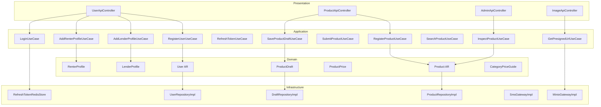
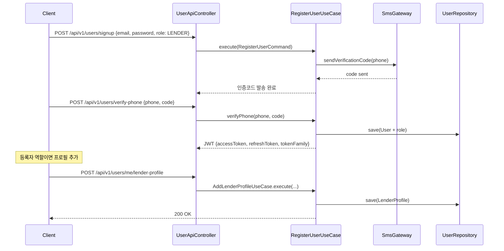
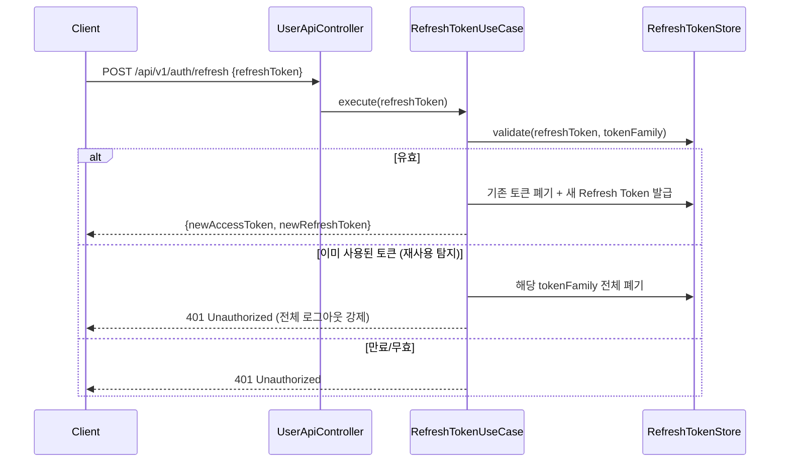
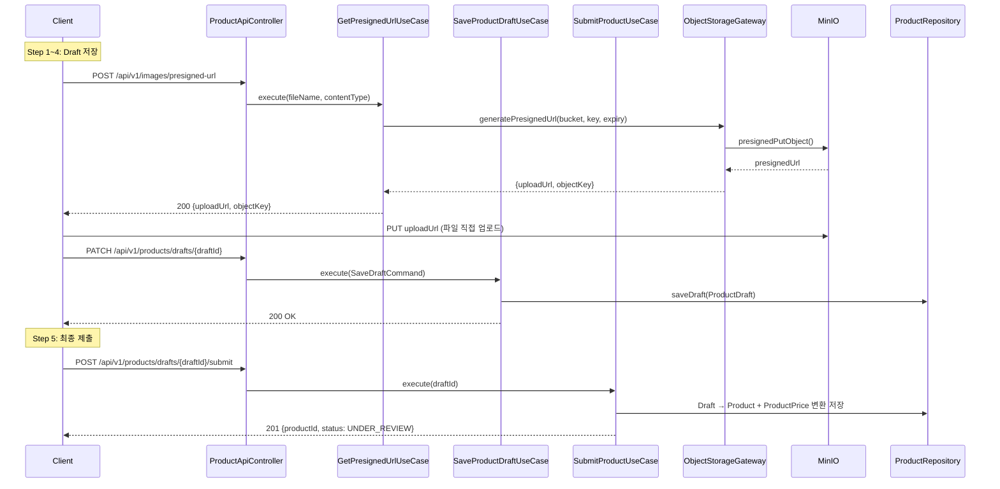
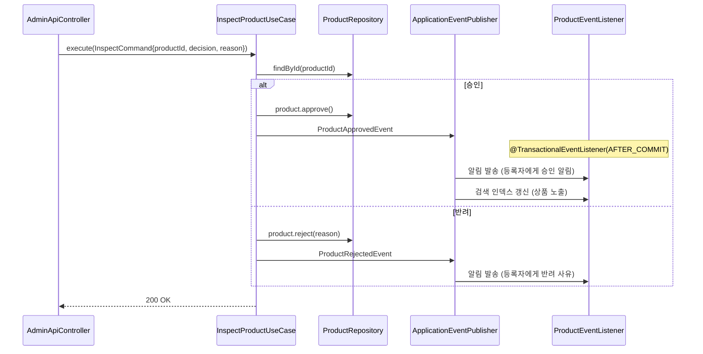

# TDD-001: Sprint 1 — 회원 + 상품 기술 설계

- **Status**: Draft → v1.1 (DBA+아키텍트 반영) → **v1.2 (Draft 통합 + 멀티모듈)**
- **Date**: 2026-04-11
- **Related ADR**: ADR-001, ADR-002, ADR-003, ADR-004
- **Sprint**: 1

## Background

대여/구독 플랫폼 MVP의 첫 번째 Sprint로, 회원 시스템과 상품 CRUD를 구축한다.
이 Sprint가 이후 대여(Sprint 2), 반납(Sprint 3)의 기반이 된다.

## Terminology

| 용어 | 설명 |
|------|------|
| User | 통합 회원 — 등록자/대여자/양쪽 역할 보유 가능 |
| LenderProfile | 등록자 프로필 — 정산 계좌, 사업자 정보 |
| RenterProfile | 대여자 프로필 — 신뢰 등급, 거래 수 |
| Product | 상품 — 대여 가능한 물건 |
| ProductPrice | 대여 단위별 가격 (일/월/연) |
| Draft | 임시저장 — 상품 등록 중 이탈 시 데이터 보존 |
| Presigned URL | MinIO에서 FE가 직접 업로드할 수 있도록 사전 서명된 URL |
| Price Guide | 카테고리별 추천 가격 범위 |

## Define Problem

1. 통합 회원 시스템 + 역할(등록자/대여자) + 소셜 로그인 + 휴대폰 인증
2. 상품 등록 다단계 폼 + 임시저장 + 이미지 업로드
3. 다중 대여 단위별 가격 지원
4. 상품 검수(승인/반려) + 검색/목록/상세
5. 카테고리별 가이드 가격 제공

## Possible Solutions

### 회원 구조
| 방안 | 장점 | 단점 | 결정 |
|------|------|------|------|
| 별도 AR (Lender/Renter) | 완전 분리, MSA 쉬움 | 이중 계정 문제, 공통 필드 중복 | ~~v1.0 채택~~ v1.1 폐기 |
| 통합 AR (User + Role + Profile) | 겸용 가능, 중복 없음 | Profile 조인 필요 | ✅ v1.1 채택 |

### 인증 방식
| 방안 | 장점 | 단점 | 결정 |
|------|------|------|------|
| JWT (Access + Refresh + Rotation) | Stateless, 탈취 대응 | 구현 복잡도 증가 | ✅ 채택 |
| Session 기반 | 서버 제어 용이 | Stateful | 미채택 |

### 이미지 업로드
| 방안 | 장점 | 단점 | 결정 |
|------|------|------|------|
| Presigned URL (FE→MinIO) | BE 병목 없음 | CORS 설정 필요 | ✅ 채택 |

### 임시저장
| 방안 | 장점 | 단점 | 결정 |
|------|------|------|------|
| 별도 Draft 테이블 (JSON) | 유연, NOT NULL 문제 없음 | 테이블 추가, 변환 필요 | ~~v1.1 채택~~ v1.2 폐기 |
| Product에 DRAFT 상태 통합 | 단일 테이블, 변환 불필요 | 미완성 필드 nullable | ✅ v1.2 채택 |

### 모듈 구조
| 방안 | 장점 | 단점 | 결정 |
|------|------|------|------|
| 단일 모듈 | 단순 | 진입점 분리 불가, 배포 단위 하나 | ~~v1.0 채택~~ v1.2 폐기 |
| 멀티모듈 (7개) | 진입점별 독립 배포, 의존 방향 강제 | 빌드 설정 복잡 | ✅ v1.2 채택 |

### 가격 구조
| 방안 | 장점 | 단점 | 결정 |
|------|------|------|------|
| Product에 단일 가격 | 단순 | 다중 대여 단위 불가 | ~~v1.0 채택~~ v1.1 폐기 |
| 별도 ProductPrice 테이블 | 다중 단위 지원, 확장 유연 | 조인 필요 | ✅ v1.1 채택 |

## Detail Design

### Component Diagram



### 회원가입 Sequence Diagram



### JWT Token Rotation Sequence



### 상품 등록 (Draft → 제출) Sequence Diagram



### 상품 검수 Sequence Diagram (이벤트 포함)



## ERD (v1.1 — DBA 리뷰 반영)

```mermaid
erDiagram
    USER {
        bigint user_id PK
        varchar(100) email UK
        varchar(50) name
        varchar(20) phone
        varchar(255) password_hash
        varchar(20) role "LENDER, RENTER, BOTH"
        varchar(20) social_provider "KAKAO, NAVER, GOOGLE, APPLE, null"
        varchar(255) social_provider_id
        datetime6 created_at
        datetime6 updated_at
    }

    LENDER_PROFILE {
        bigint lender_profile_id PK
        bigint user_id UK
        varchar(20) lender_type "INDIVIDUAL"
        varchar(20) verification_status "VERIFIED, PENDING"
        varchar(50) settlement_account_bank
        varchar(50) settlement_account_number
        datetime6 created_at
        datetime6 updated_at
    }

    RENTER_PROFILE {
        bigint renter_profile_id PK
        bigint user_id UK
        varchar(20) trust_grade "BRONZE, SILVER, GOLD"
        int total_transaction_count
        datetime6 created_at
        datetime6 updated_at
    }

    PRODUCT {
        bigint product_id PK
        bigint user_id "등록자"
        varchar(100) name
        text description
        varchar(50) category_code
        varchar(20) condition "NEW, LIKE_NEW, GOOD, FAIR"
        varchar(20) status "DRAFT, UNDER_REVIEW, APPROVED, REJECTED, AVAILABLE, RENTED"
        tinyint current_draft_step "null if not DRAFT"
        bigint deposit_amount
        varchar(500) reject_reason
        datetime6 created_at
        datetime6 updated_at
    }

    PRODUCT_PRICE {
        bigint product_price_id PK
        bigint product_id
        varchar(20) rental_unit "DAILY, MONTHLY, YEARLY"
        bigint price_amount
        datetime6 created_at
        datetime6 updated_at
    }

    PRODUCT_IMAGE {
        bigint product_image_id PK
        bigint product_id
        varchar(500) object_key
        varchar(255) original_filename
        smallint sort_order
        datetime6 created_at
    }

    CATEGORY_PRICE_GUIDE {
        bigint category_price_guide_id PK
        varchar(50) category_code
        varchar(20) rental_unit
        bigint min_price
        bigint max_price
        datetime6 created_at
        datetime6 updated_at
    }

    USER ||--o| LENDER_PROFILE : "has"
    USER ||--o| RENTER_PROFILE : "has"
    USER ||--o{ PRODUCT : "registers"
    PRODUCT ||--o{ PRODUCT_PRICE : "has prices"
    PRODUCT ||--o{ PRODUCT_IMAGE : "has images"
```



### 인덱스 정의

```sql
-- USER
CREATE UNIQUE INDEX uk_user_email ON user (email);
CREATE UNIQUE INDEX uk_user_social ON user (social_provider, social_provider_id);

-- LENDER_PROFILE
CREATE UNIQUE INDEX uk_lender_profile_user ON lender_profile (user_id);

-- RENTER_PROFILE
CREATE UNIQUE INDEX uk_renter_profile_user ON renter_profile (user_id);

-- PRODUCT
CREATE INDEX idx_product_user_id ON product (user_id);
CREATE INDEX idx_product_status_category ON product (status, category_code);
CREATE INDEX idx_product_category ON product (category_code);

-- PRODUCT_PRICE
CREATE INDEX idx_product_price_product ON product_price (product_id);
CREATE UNIQUE INDEX uk_product_price_unit ON product_price (product_id, rental_unit);

-- PRODUCT_IMAGE
CREATE INDEX idx_product_image_product_sort ON product_image (product_id, sort_order);

-- CATEGORY_PRICE_GUIDE
CREATE UNIQUE INDEX uk_category_price_guide ON category_price_guide (category_code, rental_unit);
```

## Security Information

- 비밀번호: BCrypt 해싱 (strength 12)
- JWT Access Token: 30분, RS256
- JWT Refresh Token: 14일, Redis 저장
- **Token Rotation**: Refresh 사용 시 새 토큰 발급 + 기존 폐기
- **Token Family Detection**: 이미 사용된 Refresh Token 재사용 감지 시 해당 Family 전체 폐기 (탈취 대응)
- Presigned URL: expiry 15분, PUT 전용
- Admin API: ROLE_ADMIN 권한, /api/admin/** 경로 분리

## Domain Events

| 이벤트 | 발행 시점 | 동기/비동기 | 리스너 |
|--------|----------|------------|--------|
| UserRegisteredEvent | 회원가입 완료 | 동기 | 웰컴 알림 |
| ProductApprovedEvent | 검수 승인 | 비동기 | 등록자 알림, 검색 인덱스 갱신 |
| ProductRejectedEvent | 검수 반려 | 비동기 | 등록자 알림 (반려 사유) |

## Milestone

| 순서 | 작업 | 규모 |
|------|------|------|
| 1 | 공통 인프라 (BaseEntity, ErrorResponse, JWT + Token Rotation, MinIO 설정) | L |
| 2 | User 도메인 (가입, 인증, 소셜 로그인, Role 관리) | L |
| 3 | LenderProfile / RenterProfile | M |
| 4 | Product 도메인 (Draft, 등록, ProductPrice, 이미지) | L |
| 5 | Product 검수 (Admin 승인/반려 + 도메인 이벤트) | M |
| 6 | Product 검색/목록/상세 (QueryDSL) | M |
| 7 | 카테고리 가이드 가격 | S |
| 8 | 마이페이지, 알림, 상품 관리 | M |

## Testing Plan

### 단위 테스트 (Kotest BehaviorSpec)
- User: 가입 유효성, 역할 부여/전환(LENDER→BOTH), 소셜 로그인, 전화번호 스킵
- LenderProfile: 정산 계좌 등록, 검증 상태 전이
- RenterProfile: 등급 초기화, 승급 조건
- Product: 상태 전이(UNDER_REVIEW→APPROVED/REJECTED→AVAILABLE), 도메인 이벤트 발행
- ProductPrice: 다중 단위 가격, 유효성 검증
- ProductDraft: Step별 저장, 만료, Draft→Product+ProductPrice 변환
- JWT: 토큰 생성/검증/만료, Token Rotation, Family Detection

### 통합 테스트 (TestContainers)
- MySQL: User/Product CRUD, QueryDSL 검색, 인덱스 활용 확인
- Redis: JWT Refresh Token 저장/Rotation/Family 폐기
- MinIO: Presigned URL 생성/업로드

## Release Scenario

1. DB 마이그레이션 (Flyway): user, lender_profile, renter_profile, product, product_price, product_image, product_draft, category_price_guide
2. MinIO 버킷 생성 + CORS 설정
3. 카테고리 가이드 가격 seed 데이터 적재
4. 애플리케이션 배포
5. 스모크 테스트 (k6 S01, S02)

### 롤백 플랜
- DB 마이그레이션 롤백 스크립트 준비
- 피처 플래그 제어

## Project Information

- **모듈**: rental-commerce (모놀리스)
- **ADR**: ADR-001, ADR-002, ADR-003, ADR-004
- **관련 PRD**: PRD v1.1 Sprint 1
- **디자인**: Sprint 1 화면 구성 v1.1

## Document History

| 날짜 | 버전 | 변경 내용 |
|------|------|----------|
| 2026-04-11 | 1.0 | 초안 작성 |
| 2026-04-11 | 1.1 | DBA 리뷰 반영 (인덱스, 타입, 가격 테이블 분리) + 아키텍트 리뷰 반영 (User 통합, Token Rotation, 이벤트, Presigned URL 격리) |
| 2026-04-11 | 1.2 | product_draft 제거 → Product DRAFT 상태 통합 + 멀티모듈 분리 (7모듈: api/worker/batch/socket/application/domain/infrastructure) |
