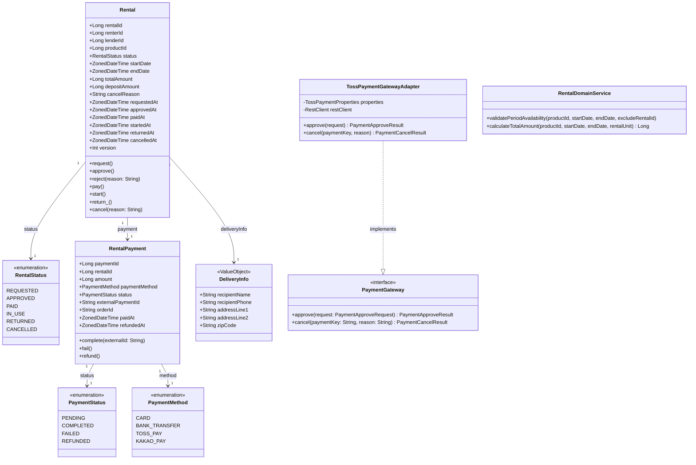
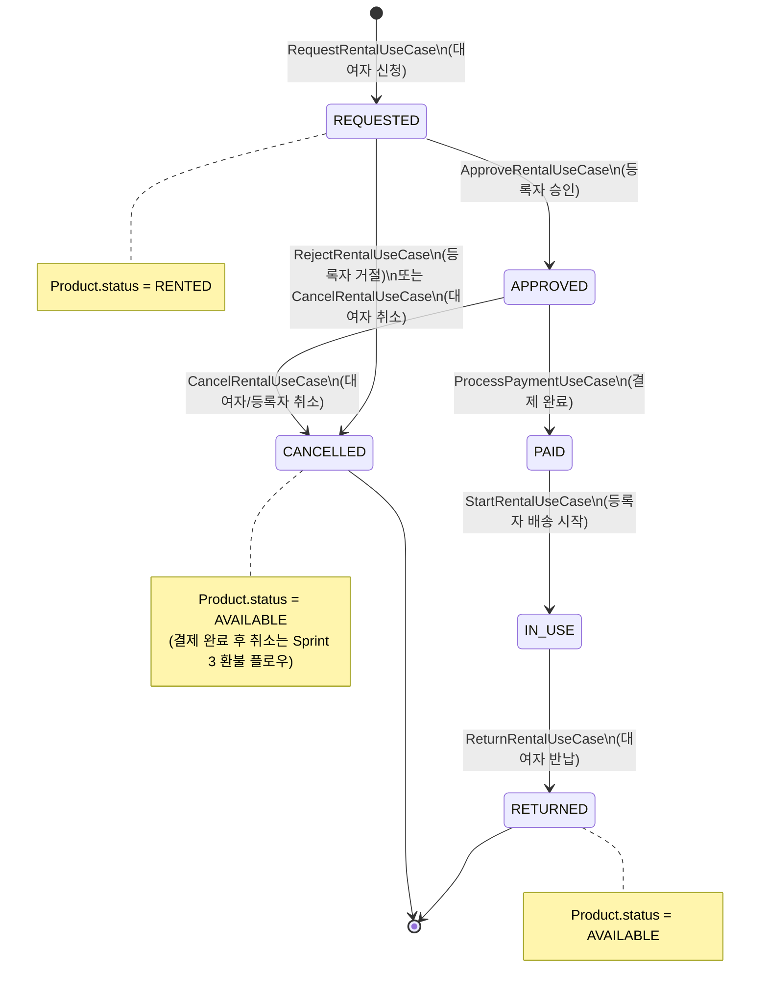
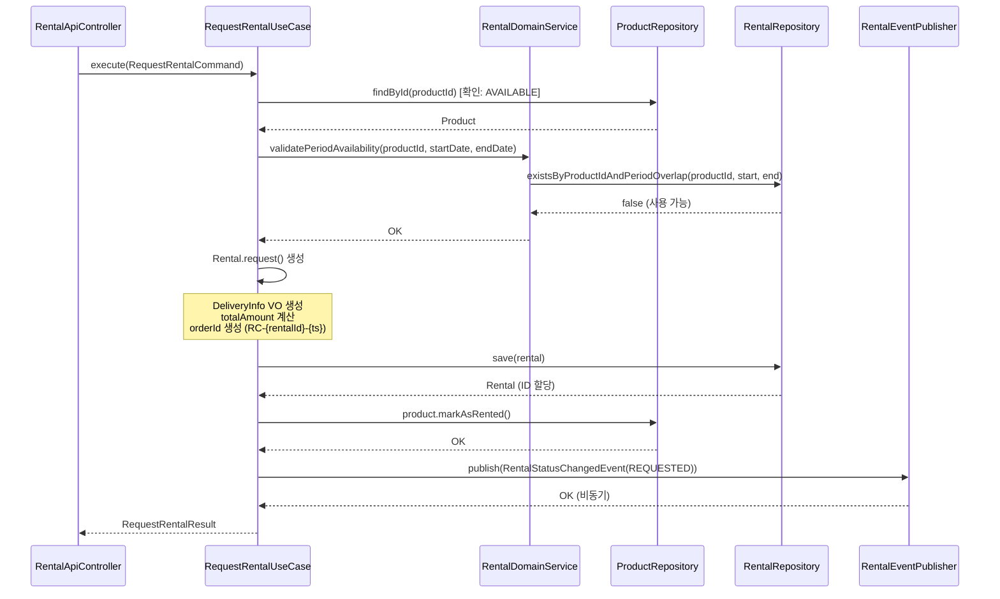
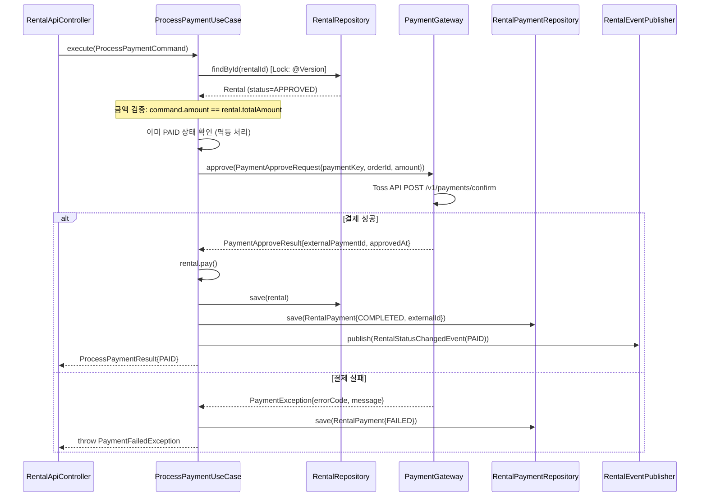
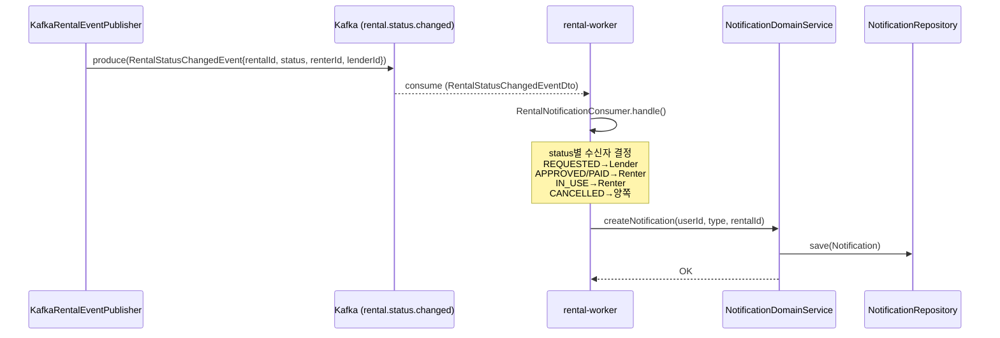

# TDD-002: Sprint 2 — 대여/결제 기술 설계

- **Status**: Draft v1.0
- **Date**: 2026-04-14
- **Related ADR**: ADR-005 (결제 Gateway 추상화), ADR-006 (대여 상태 전이)
- **Sprint**: 2
- **Related PRD**: PRD-002-sprint2-rental-payment.md

---

## Background

Sprint 1에서 User, Product, Inspect MVP가 완성되었다. Sprint 2는 실제 대여 트랜잭션 핵심 플로우를 구현한다. 대여(Rental) Aggregate Root, 결제(RentalPayment), 배송 정보(DeliveryInfo VO)를 신규 도입하고, Hexagonal Architecture(Port-Adapter 패턴)를 통해 외부 결제사(Toss Payments)를 추상화한다.

---

## Terminology

| 용어 | 설명 |
|------|------|
| Rental | 대여 Aggregate Root — 대여자와 등록자 간 단일 대여 계약 |
| RentalStatus | 대여 생애주기 상태 Enum |
| RentalPayment | 결제 레코드 Entity — Rental과 1:1 |
| DeliveryInfo | 배송 수령 정보 Value Object (주소, 수령인, 연락처) |
| PaymentGateway | 결제 추상화 Port Interface |
| TossPaymentGatewayAdapter | Toss Payments REST API 호출 Adapter 구현체 |
| RentalDomainService | 상태 전이 / 중복 기간 검사 로직 캡슐화 |
| rental.status.changed | Kafka 이벤트 토픽 — 대여 상태 변경 시 발행 |

---

## Define Problem

1. 대여 생애주기(REQUESTED→APPROVED→PAID→IN_USE→RETURNED/CANCELLED) 상태 전이 무결성 보장
2. 동일 상품 동시 대여 신청 Race Condition 방지 (낙관적 락)
3. 결제 멱등성 — 중복 결제 API 호출 차단
4. 외부 PG(Toss Payments) 장애 시 대여 상태 불일치 방지 (Saga 패턴 준비)
5. 대여자/등록자 양쪽 접근 권한 분리 — 타인의 대여 조작 차단
6. Kafka 이벤트 기반 알림 연동 (기존 Notification 모듈 재사용)

---

## Possible Solutions

### 결제 추상화 방식

| 방안 | 장점 | 단점 | 결정 |
|------|------|------|------|
| Toss Payments SDK 직접 주입 | 빠른 구현 | PG 교체 불가, 테스트 어려움 | 미채택 |
| Port-Adapter (PaymentGateway Interface) | PG 교체 용이, MockGateway 테스트 | 코드량 증가 | ✅ 채택 |
| 별도 결제 마이크로서비스 | 완전 격리 | 오버엔지니어링 (현재 규모) | 미채택 |

### 동시성 제어 방식

| 방안 | 장점 | 단점 | 결정 |
|------|------|------|------|
| 비관적 락 (SELECT FOR UPDATE) | 확실한 격리 | 성능 저하, 데드락 위험 | 미채택 |
| 낙관적 락 (@Version) | 성능 우수, 충돌 드묾 | 재시도 로직 필요 | ✅ 채택 |
| 분산 락 (Redis Redisson) | 멀티 노드 환경 강력 | 인프라 복잡도 | Sprint 3 고려 |

### 결제-대여 정합성

| 방안 | 장점 | 단점 | 결정 |
|------|------|------|------|
| 2PC (Two-Phase Commit) | 강한 일관성 | 성능 저하, PG 미지원 | 미채택 |
| Outbox Pattern | 이벤트 유실 없음 | 구현 복잡 | Sprint 3 개선 |
| 단순 try-catch + 보상 트랜잭션 | 빠른 구현 | 완전한 ACID 아님 | ✅ MVP 채택 |

---

## Detail Design

### 1. 기술 아키텍처 (Hexagonal / Port-Adapter)

```
┌──────────────────────────────────────────────────────────────────┐
│                         Presentation Layer                       │
│  RentalApiController  ·  RentalAdminController                   │
│  (rental-web / rental-api)                                       │
└───────────────────────────────┬──────────────────────────────────┘
                                │ Command / Query
┌───────────────────────────────▼──────────────────────────────────┐
│                        Application Layer                         │
│  RequestRentalUseCase      ApproveRentalUseCase                  │
│  RejectRentalUseCase       ProcessPaymentUseCase                 │
│  StartRentalUseCase        ReturnRentalUseCase                   │
│  CancelRentalUseCase       GetMyRentalsUseCase                   │
│  GetRentalDetailUseCase                                          │
│  (rental-application)                                            │
└──────────────┬─────────────────────────┬────────────────────────┘
               │ Domain Service          │ Port (Interface)
┌──────────────▼──────────────┐  ┌───────▼────────────────────────┐
│       Domain Layer          │  │         Port Interfaces         │
│  Rental (AR)                │  │  RentalRepository               │
│  RentalPayment              │  │  RentalPaymentRepository        │
│  DeliveryInfo (VO)          │  │  PaymentGateway                 │
│  RentalStatus (Enum)        │  │  RentalEventPublisher           │
│  PaymentStatus (Enum)       │  │                                 │
│  RentalDomainService        │  └───────┬────────────────────────┘
│  (rental-domain)            │          │ Adapter
└─────────────────────────────┘  ┌───────▼────────────────────────┐
                                 │      Infrastructure Layer       │
                                 │  RentalRepositoryImpl (JPA)     │
                                 │  RentalPaymentRepositoryImpl    │
                                 │  TossPaymentGatewayAdapter      │
                                 │  KafkaRentalEventPublisher      │
                                 │  (rental-infrastructure)        │
                                 └────────────────────────────────┘
```

---

### 2. 도메인 모델 (Class Diagram)



---

### 3. 상태 전이 다이어그램 (State Diagram)



---

### 4. API 명세

#### 4.1 대여 신청

```
POST /api/v1/rentals
Authorization: Bearer {accessToken}
Content-Type: application/json

Request Body:
{
  "productId": 42,
  "startDate": "2026-05-01",
  "endDate": "2026-05-07",
  "deliveryInfo": {
    "recipientName": "홍길동",
    "recipientPhone": "010-1234-5678",
    "addressLine1": "서울특별시 강남구 테헤란로 123",
    "addressLine2": "101호",
    "zipCode": "06234"
  }
}

Response 201 Created:
{
  "rentalId": 1001,
  "productId": 42,
  "status": "REQUESTED",
  "startDate": "2026-05-01",
  "endDate": "2026-05-07",
  "totalAmount": 70000,
  "depositAmount": 50000,
  "requestedAt": "2026-04-14T10:00:00+09:00"
}

Error Responses:
400 Bad Request       - 유효성 검증 실패 (날짜, 주소 등)
404 Not Found         - 상품 없음
409 Conflict          - 해당 기간 이미 대여 신청 존재 (RENTAL_PERIOD_CONFLICT)
422 Unprocessable     - 상품이 AVAILABLE 상태 아님 (PRODUCT_NOT_AVAILABLE)
```

#### 4.2 대여 승인

```
PATCH /api/v1/rentals/{rentalId}/approve
Authorization: Bearer {accessToken} (등록자만)

Response 200 OK:
{
  "rentalId": 1001,
  "status": "APPROVED",
  "approvedAt": "2026-04-14T11:00:00+09:00"
}

Error Responses:
403 Forbidden         - 등록자 본인 아님
404 Not Found         - 대여 없음
409 Conflict          - REQUESTED 상태 아님 (INVALID_STATUS_TRANSITION)
```

#### 4.3 대여 거절

```
PATCH /api/v1/rentals/{rentalId}/reject
Authorization: Bearer {accessToken} (등록자만)
Content-Type: application/json

Request Body:
{
  "reason": "해당 기간에 다른 일정이 생겼습니다."
}

Response 200 OK:
{
  "rentalId": 1001,
  "status": "CANCELLED",
  "cancelReason": "해당 기간에 다른 일정이 생겼습니다.",
  "cancelledAt": "2026-04-14T11:05:00+09:00"
}

Error Responses:
400 Bad Request       - reason 누락 또는 10자 미만
403 Forbidden         - 등록자 본인 아님
409 Conflict          - REQUESTED 상태 아님
```

#### 4.4 결제 처리

```
POST /api/v1/rentals/{rentalId}/payment
Authorization: Bearer {accessToken} (대여자만)
Content-Type: application/json

Request Body:
{
  "paymentKey": "5zJ4xY7m0kODnyRpQWGrN2eqXgarbMe7zEX5sGR0",
  "orderId": "RC-1001-1713063600000",
  "amount": 120000,
  "paymentMethod": "CARD"
}

Response 200 OK:
{
  "rentalId": 1001,
  "paymentId": 5001,
  "status": "PAID",
  "externalPaymentId": "5zJ4xY7m0kODnyRpQWGrN2eqXgarbMe7zEX5sGR0",
  "paidAt": "2026-04-14T12:00:00+09:00"
}

Error Responses:
402 Payment Required  - 결제 실패 (PAYMENT_FAILED)
409 Conflict          - APPROVED 상태 아님
409 Conflict          - 이미 결제 완료 (ALREADY_PAID) — 기존 결제 정보 반환
422 Unprocessable     - amount 불일치 (AMOUNT_MISMATCH)
```

#### 4.5 대여 시작 (배송 시작)

```
PATCH /api/v1/rentals/{rentalId}/start
Authorization: Bearer {accessToken} (등록자만)

Response 200 OK:
{
  "rentalId": 1001,
  "status": "IN_USE",
  "startedAt": "2026-04-15T09:00:00+09:00"
}

Error Responses:
403 Forbidden         - 등록자 본인 아님
409 Conflict          - PAID 상태 아님
```

#### 4.6 반납 처리

```
PATCH /api/v1/rentals/{rentalId}/return
Authorization: Bearer {accessToken} (대여자만)

Response 200 OK:
{
  "rentalId": 1001,
  "status": "RETURNED",
  "returnedAt": "2026-05-07T18:00:00+09:00"
}

Error Responses:
403 Forbidden         - 대여자 본인 아님
409 Conflict          - IN_USE 상태 아님
```

#### 4.7 대여 취소

```
PATCH /api/v1/rentals/{rentalId}/cancel
Authorization: Bearer {accessToken} (대여자 또는 등록자)
Content-Type: application/json

Request Body:
{
  "reason": "일정이 변경되었습니다."
}

Response 200 OK:
{
  "rentalId": 1001,
  "status": "CANCELLED",
  "cancelReason": "일정이 변경되었습니다.",
  "cancelledAt": "2026-04-14T13:00:00+09:00"
}

Error Responses:
403 Forbidden         - 당사자(대여자/등록자) 아님
409 Conflict          - REQUESTED/APPROVED 상태 아님 (PAID 이후 취소 불가 — Sprint 3)
```

#### 4.8 내 대여 목록 조회

```
GET /api/v1/rentals?role={RENTER|LENDER}&status={상태}&page={0}&size={20}
Authorization: Bearer {accessToken}

Response 200 OK:
{
  "content": [
    {
      "rentalId": 1001,
      "productId": 42,
      "productName": "캠핑 텐트 A",
      "productThumbnailUrl": "https://...",
      "status": "IN_USE",
      "startDate": "2026-05-01",
      "endDate": "2026-05-07",
      "totalAmount": 120000,
      "requestedAt": "2026-04-14T10:00:00+09:00"
    }
  ],
  "totalElements": 5,
  "totalPages": 1,
  "size": 20,
  "number": 0
}
```

#### 4.9 대여 상세 조회

```
GET /api/v1/rentals/{rentalId}
Authorization: Bearer {accessToken}

Response 200 OK:
{
  "rentalId": 1001,
  "product": {
    "productId": 42,
    "name": "캠핑 텐트 A",
    "thumbnailUrl": "https://...",
    "category": "CAMPING"
  },
  "renter": { "userId": 11, "name": "홍길동" },
  "lender": { "userId": 22, "name": "김철수" },
  "status": "IN_USE",
  "startDate": "2026-05-01",
  "endDate": "2026-05-07",
  "totalAmount": 120000,
  "depositAmount": 50000,
  "deliveryInfo": {
    "recipientName": "홍길동",
    "recipientPhone": "010-1234-5678",
    "addressLine1": "서울특별시 강남구 테헤란로 123",
    "addressLine2": "101호",
    "zipCode": "06234"
  },
  "payment": {
    "paymentId": 5001,
    "amount": 120000,
    "paymentMethod": "CARD",
    "status": "COMPLETED",
    "paidAt": "2026-04-14T12:00:00+09:00"
  },
  "timeline": [
    { "status": "REQUESTED", "occurredAt": "2026-04-14T10:00:00+09:00" },
    { "status": "APPROVED",  "occurredAt": "2026-04-14T11:00:00+09:00" },
    { "status": "PAID",      "occurredAt": "2026-04-14T12:00:00+09:00" },
    { "status": "IN_USE",    "occurredAt": "2026-04-15T09:00:00+09:00" }
  ],
  "requestedAt": "2026-04-14T10:00:00+09:00"
}

Error Responses:
403 Forbidden         - 당사자 아님
404 Not Found         - 대여 없음
```

---

### 5. 내부 시퀀스 다이어그램 (BE 호출 흐름)

#### 5.1 RequestRentalUseCase 내부 흐름



#### 5.2 ProcessPaymentUseCase 내부 흐름



#### 5.3 Kafka 이벤트 → Notification 흐름



---

### 6. DB 스키마 (DDL)

```sql
-- ===================================================
-- V2__create_rental_tables.sql
-- ===================================================

CREATE TABLE rental (
    rental_id           BIGINT          NOT NULL AUTO_INCREMENT,
    renter_id           BIGINT          NOT NULL COMMENT '대여자 user_id',
    lender_id           BIGINT          NOT NULL COMMENT '등록자 user_id',
    product_id          BIGINT          NOT NULL COMMENT '상품 id',
    status              VARCHAR(20)     NOT NULL COMMENT 'REQUESTED|APPROVED|PAID|IN_USE|RETURNED|CANCELLED',
    start_date          DATE            NOT NULL COMMENT '대여 시작일',
    end_date            DATE            NOT NULL COMMENT '대여 종료일',
    total_amount        BIGINT          NOT NULL COMMENT '대여료 합계',
    deposit_amount      BIGINT          NOT NULL DEFAULT 0 COMMENT '보증금',
    order_id            VARCHAR(100)    NOT NULL COMMENT 'PG orderId (RC-{id}-{ts})',
    cancel_reason       TEXT            NULL,
    requested_at        DATETIME(6)     NOT NULL,
    approved_at         DATETIME(6)     NULL,
    paid_at             DATETIME(6)     NULL,
    started_at          DATETIME(6)     NULL,
    returned_at         DATETIME(6)     NULL,
    cancelled_at        DATETIME(6)     NULL,
    version             INT             NOT NULL DEFAULT 0 COMMENT '낙관적 락',
    created_at          DATETIME(6)     NOT NULL,
    updated_at          DATETIME(6)     NOT NULL,
    PRIMARY KEY (rental_id)
) ENGINE=InnoDB DEFAULT CHARSET=utf8mb4 COLLATE=utf8mb4_unicode_ci
  COMMENT='대여 트랜잭션';

CREATE TABLE rental_delivery_info (
    delivery_info_id    BIGINT          NOT NULL AUTO_INCREMENT,
    rental_id           BIGINT          NOT NULL UNIQUE,
    recipient_name      VARCHAR(50)     NOT NULL COMMENT '수령인 이름',
    recipient_phone     VARCHAR(20)     NOT NULL COMMENT '수령인 연락처',
    address_line1       VARCHAR(200)    NOT NULL COMMENT '도로명/지번 주소',
    address_line2       VARCHAR(100)    NULL COMMENT '상세 주소',
    zip_code            VARCHAR(10)     NOT NULL COMMENT '우편번호',
    created_at          DATETIME(6)     NOT NULL,
    updated_at          DATETIME(6)     NOT NULL,
    PRIMARY KEY (delivery_info_id)
) ENGINE=InnoDB DEFAULT CHARSET=utf8mb4 COLLATE=utf8mb4_unicode_ci
  COMMENT='대여 배송 정보';

CREATE TABLE rental_payment (
    payment_id          BIGINT          NOT NULL AUTO_INCREMENT,
    rental_id           BIGINT          NOT NULL UNIQUE COMMENT '1:1 with rental',
    amount              BIGINT          NOT NULL COMMENT '결제 금액',
    payment_method      VARCHAR(20)     NOT NULL COMMENT 'CARD|BANK_TRANSFER|TOSS_PAY|KAKAO_PAY',
    status              VARCHAR(20)     NOT NULL COMMENT 'PENDING|COMPLETED|FAILED|REFUNDED',
    external_payment_id VARCHAR(200)    NULL UNIQUE COMMENT 'Toss paymentKey',
    order_id            VARCHAR(100)    NOT NULL UNIQUE COMMENT 'RC-{rentalId}-{ts}',
    paid_at             DATETIME(6)     NULL,
    refunded_at         DATETIME(6)     NULL,
    created_at          DATETIME(6)     NOT NULL,
    updated_at          DATETIME(6)     NOT NULL,
    PRIMARY KEY (payment_id)
) ENGINE=InnoDB DEFAULT CHARSET=utf8mb4 COLLATE=utf8mb4_unicode_ci
  COMMENT='대여 결제';

-- ===================================================
-- 인덱스
-- ===================================================

-- rental
CREATE INDEX idx_rental_renter_id        ON rental (renter_id);
CREATE INDEX idx_rental_lender_id        ON rental (lender_id);
CREATE INDEX idx_rental_product_id       ON rental (product_id);
CREATE INDEX idx_rental_status           ON rental (status);
CREATE INDEX idx_rental_product_period   ON rental (product_id, start_date, end_date);
CREATE UNIQUE INDEX uk_rental_order_id   ON rental (order_id);

-- rental_delivery_info
CREATE UNIQUE INDEX uk_delivery_rental   ON rental_delivery_info (rental_id);

-- rental_payment
CREATE UNIQUE INDEX uk_payment_rental    ON rental_payment (rental_id);
CREATE UNIQUE INDEX uk_payment_external  ON rental_payment (external_payment_id);
CREATE UNIQUE INDEX uk_payment_order     ON rental_payment (order_id);
```

---

### 7. 도메인 이벤트 (Domain Events)

| 이벤트 토픽 | key 구조 | Payload 필드 | 발행 시점 | Consumer |
|------------|---------|-------------|---------|---------|
| `event.closet.rental` | `rental.{rentalId}` | rentalId, prevStatus, newStatus, renterId, lenderId, productId, occurredAt | 모든 상태 전이 | rental-worker |
| `event.closet.payment` | `payment.{paymentId}` | paymentId, rentalId, amount, status, occurredAt | 결제 완료/실패 | rental-worker |

#### Kafka 이벤트 Payload 스키마

```json
{
  "eventId": "UUID",
  "eventType": "RENTAL_STATUS_CHANGED",
  "occurredAt": "2026-04-14T10:00:00+09:00",
  "payload": {
    "rentalId": 1001,
    "prevStatus": "REQUESTED",
    "newStatus": "APPROVED",
    "renterId": 11,
    "lenderId": 22,
    "productId": 42
  }
}
```

---

### 8. PaymentGateway Port-Adapter 설계

```kotlin
// Port (Domain Layer)
interface PaymentGateway {
    fun approve(request: PaymentApproveRequest): PaymentApproveResult
    fun cancel(paymentKey: String, cancelAmount: Long, reason: String): PaymentCancelResult
}

data class PaymentApproveRequest(
    val paymentKey: String,
    val orderId: String,
    val amount: Long
)

data class PaymentApproveResult(
    val externalPaymentId: String,
    val approvedAt: ZonedDateTime,
    val method: String
)

// Adapter (Infrastructure Layer)
@Component
class TossPaymentGatewayAdapter(
    private val properties: TossPaymentProperties,
    private val restClient: RestClient
) : PaymentGateway {

    override fun approve(request: PaymentApproveRequest): PaymentApproveResult {
        // POST https://api.tosspayments.com/v1/payments/confirm
        // Authorization: Basic Base64(secretKey:)
    }

    override fun cancel(paymentKey: String, cancelAmount: Long, reason: String): PaymentCancelResult {
        // POST https://api.tosspayments.com/v1/payments/{paymentKey}/cancel
    }
}

// Test Double
@Component
@Profile("test")
class MockPaymentGateway : PaymentGateway {
    override fun approve(request: PaymentApproveRequest) =
        PaymentApproveResult(
            externalPaymentId = "mock-${UUID.randomUUID()}",
            approvedAt = ZonedDateTime.now(),
            method = "CARD"
        )
    override fun cancel(paymentKey: String, cancelAmount: Long, reason: String) =
        PaymentCancelResult(cancelledAt = ZonedDateTime.now())
}
```

---

### 9. UseCase 구현 가이드라인

#### 9.1 공통 원칙
- `@Transactional`은 UseCase에만 위치 (Infrastructure 금지)
- Repository 직접 호출 금지 — RentalDomainService 경유
- FQCN 사용 금지 (import로 처리)
- 모든 시간 타입: `ZonedDateTime` (LocalDateTime 금지)
- 금액 타입: `Long` (단위: 원)

#### 9.2 RequestRentalUseCase

```kotlin
@UseCase
@Transactional
class RequestRentalUseCase(
    private val rentalDomainService: RentalDomainService,
    private val productRepository: ProductRepository,
    private val rentalRepository: RentalRepository,
    private val eventPublisher: RentalEventPublisher
) {
    fun execute(command: RequestRentalCommand): RequestRentalResult {
        val product = productRepository.findByIdOrThrow(command.productId)
        product.validateAvailable()
        rentalDomainService.validatePeriodAvailability(
            command.productId, command.startDate, command.endDate
        )
        val totalAmount = rentalDomainService.calculateTotalAmount(
            product, command.startDate, command.endDate
        )
        val rental = Rental.request(
            renterId = command.renterId,
            lenderId = product.userId,
            productId = command.productId,
            startDate = command.startDate,
            endDate = command.endDate,
            deliveryInfo = command.deliveryInfo,
            totalAmount = totalAmount,
            depositAmount = product.depositAmount
        )
        val saved = rentalRepository.save(rental)
        product.markAsRented()
        eventPublisher.publish(RentalStatusChangedEvent.of(saved))
        return RequestRentalResult.from(saved)
    }
}
```

---

### 10. 테스트 케이스 목록

#### 10.1 단위 테스트 (Kotest BehaviorSpec)

**Rental 도메인 엔티티**

| TC-ID | 테스트명 | 시나리오 | 예상 결과 |
|-------|---------|---------|---------|
| UT-R01 | 정상 대여 신청 | AVAILABLE 상품 + 유효 기간 | Rental(REQUESTED) 생성, requestedAt 설정 |
| UT-R02 | 승인 처리 | REQUESTED → approve() | status=APPROVED, approvedAt 설정 |
| UT-R03 | 거절 처리 | REQUESTED → reject(reason) | status=CANCELLED, cancelReason 설정 |
| UT-R04 | 결제 완료 | APPROVED → pay() | status=PAID, paidAt 설정 |
| UT-R05 | 대여 시작 | PAID → start() | status=IN_USE, startedAt 설정 |
| UT-R06 | 반납 처리 | IN_USE → return_() | status=RETURNED, returnedAt 설정 |
| UT-R07 | 취소 처리 (REQUESTED) | REQUESTED → cancel() | status=CANCELLED |
| UT-R08 | 취소 처리 (APPROVED) | APPROVED → cancel() | status=CANCELLED |
| UT-R09 | 불법 전이 차단 — PAID에서 approve() | pay 후 approve() 호출 | IllegalStateException |
| UT-R10 | 불법 전이 차단 — RETURNED에서 cancel() | return 후 cancel() 호출 | IllegalStateException |
| UT-R11 | 불법 전이 차단 — CANCELLED에서 approve() | cancel 후 approve() 호출 | IllegalStateException |
| UT-R12 | 동일 상태 멱등 처리 — APPROVED에서 approve() | approve() 재호출 | 에러 없이 현재 상태 반환 |

**RentalDomainService**

| TC-ID | 테스트명 | 시나리오 | 예상 결과 |
|-------|---------|---------|---------|
| UT-DS01 | 기간 중복 없음 | 기존 대여와 겹치지 않는 날짜 | 유효성 통과 |
| UT-DS02 | 기간 완전 포함 | 기존 대여 기간 완전히 포함 | RentalPeriodConflictException |
| UT-DS03 | 기간 부분 겹침 (시작) | 기존 종료일 이후 + 새 시작일 이전 포함 | RentalPeriodConflictException |
| UT-DS04 | 기간 부분 겹침 (종료) | 기존 시작일 이후 + 새 종료일 포함 | RentalPeriodConflictException |
| UT-DS05 | CANCELLED 상태 대여는 무시 | 취소된 대여와 날짜 겹침 | 유효성 통과 |
| UT-DS06 | 일 단위 금액 계산 | 일 5,000원 × 7일 | 35,000원 |

**ProcessPaymentUseCase**

| TC-ID | 테스트명 | 시나리오 | 예상 결과 |
|-------|---------|---------|---------|
| UT-P01 | 정상 결제 처리 | APPROVED 대여 + PG 성공 | status=PAID, RentalPayment(COMPLETED) |
| UT-P02 | 금액 불일치 차단 | command.amount != rental.totalAmount | AmountMismatchException |
| UT-P03 | PG 결제 실패 | PG 오류 응답 | PaymentFailedException, RentalPayment(FAILED) |
| UT-P04 | 중복 결제 요청 멱등 | 이미 PAID 상태 | 기존 결제 정보 반환, 재처리 없음 |
| UT-P05 | APPROVED 아닌 상태에서 결제 | REQUESTED 상태에서 결제 시도 | InvalidStatusTransitionException |

#### 10.2 통합 테스트 (Testcontainers — MySQL + Kafka)

| TC-ID | 테스트명 | 검증 내용 |
|-------|---------|---------|
| IT-01 | 전체 대여 플로우 E2E | REQUESTED→APPROVED→PAID→IN_USE→RETURNED 전체 상태 전이 + DB 영속성 확인 |
| IT-02 | 동시 대여 신청 동시성 | 동일 상품에 10개 스레드 동시 신청 → 1건만 성공, 9건 409 |
| IT-03 | 대여 기간 중복 차단 | 기존 APPROVED 대여와 겹치는 신규 신청 → 409 |
| IT-04 | QueryDSL 대여 목록 조회 | 대여자/등록자 역할별 목록 + 상태 필터 + 페이지네이션 |
| IT-05 | 결제 성공 후 Kafka 이벤트 발행 | RentalStatusChangedEvent PAID 이벤트 토픽 수신 확인 |
| IT-06 | 결제 실패 후 상태 유지 | PG 실패 시 Rental status=APPROVED 유지 (롤백 확인) |
| IT-07 | 낙관적 락 동시성 | version 충돌 → OptimisticLockingFailureException → 409 |
| IT-08 | 반납 후 Product 상태 복원 | RETURNED 후 product.status = AVAILABLE 확인 |
| IT-09 | 취소 후 Product 상태 복원 | CANCELLED 후 product.status = AVAILABLE 확인 |
| IT-10 | 타인 승인 시도 차단 | 등록자 아닌 사용자가 approve() 호출 → 403 |

---

### 11. Flyway 마이그레이션 계획

```
rental-infrastructure/src/main/resources/db/migration/
  V2__create_rental_tables.sql      ← rental + rental_delivery_info + rental_payment + 인덱스
  V2_1__seed_rental_test_data.sql   ← 테스트/스테이징 시드 데이터 (prod 제외)
```

---

### 12. 멀티모듈 의존 관계

```
rental-web
  └─ rental-api (Controller, Request/Response DTO)
       └─ rental-application (UseCase, Command, Result)
            └─ rental-domain (Entity, Port Interface, DomainService, Event)
rental-infrastructure (Adapter 구현체)
  └─ rental-domain
rental-worker (Kafka Consumer)
  └─ rental-application
  └─ rental-domain
```

---

## Milestone (Sprint 2)

| 순서 | 작업 | 규모 | 담당 |
|------|------|------|------|
| 1 | Rental/RentalPayment/DeliveryInfo 도메인 엔티티 + 상태 전이 | L | BE |
| 2 | RentalDomainService (기간 검증, 금액 계산) | M | BE |
| 3 | RequestRentalUseCase + ApproveRentalUseCase + RejectRentalUseCase | L | BE |
| 4 | ProcessPaymentUseCase + PaymentGateway Port + TossPaymentGatewayAdapter | L | BE |
| 5 | StartRentalUseCase + ReturnRentalUseCase + CancelRentalUseCase | M | BE |
| 6 | GetMyRentalsUseCase + GetRentalDetailUseCase (QueryDSL) | M | BE |
| 7 | RentalApiController (7개 엔드포인트) | M | BE |
| 8 | Kafka 이벤트 발행 + Worker Consumer | M | BE/DevOps |
| 9 | Flyway V2 마이그레이션 | S | BE/DevOps |
| 10 | 단위 테스트 (Kotest) | M | BE |
| 11 | 통합 테스트 (Testcontainers) | L | BE |
| 12 | FE 대여 신청 페이지 + 결제 페이지 | L | FE |
| 13 | FE 내 대여 목록 + 대여 상세 페이지 | L | FE |
| 14 | FE 등록자 대여 관리 페이지 | M | FE |
| 15 | k6 부하 테스트 (동시성 검증) | M | DevOps |

---

## Release Scenario

1. Flyway 마이그레이션 적용 (V2 스크립트)
2. Kafka 토픽 `event.closet.rental` 생성 (partition: 3, replication: 2)
3. Toss Payments 시크릿 키 환경 변수 설정
4. 애플리케이션 + Worker 배포
5. 스모크 테스트: 대여 신청 → 승인 → 결제 → 시작 → 반납 플로우 검증
6. k6 동시성 테스트 (500 VU, 5분)

### 롤백 플랜

- V2 마이그레이션 롤백 스크립트 준비 (`V2__rollback_rental_tables.sql`)
- 피처 플래그: `feature.rental-payment.enabled` = false → 대여 신청 버튼 숨김
- Kafka 이벤트 처리 실패 시 DLQ(Dead Letter Queue) `event.closet.rental.dlq` 격리

---

## Project Information

- **모듈**: rental-commerce (멀티모듈 모놀리스)
- **ADR**: ADR-005, ADR-006
- **Related PRD**: PRD-002-sprint2-rental-payment.md
- **Sprint**: 2

---

## Document History

| 날짜 | 버전 | 변경 내용 |
|------|------|----------|
| 2026-04-14 | 1.0 | 초안 작성 — Sprint 2 대여/결제 기술 설계 |
