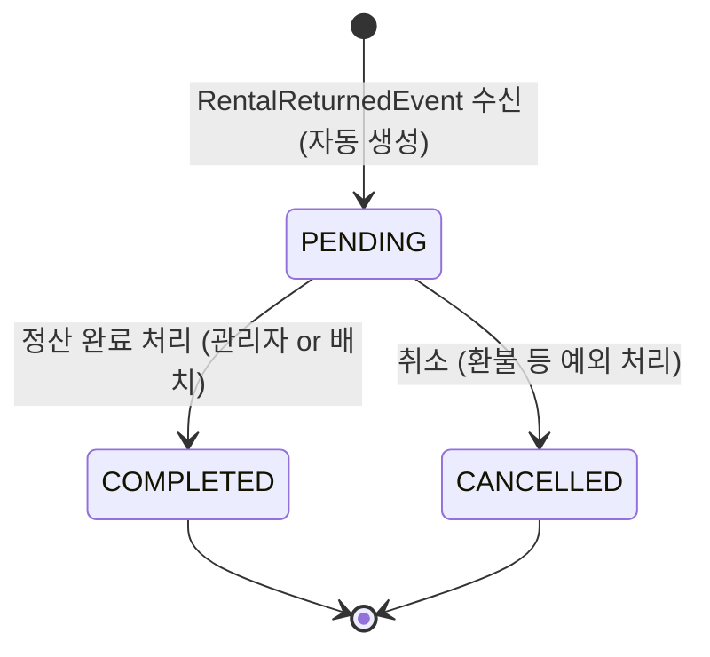
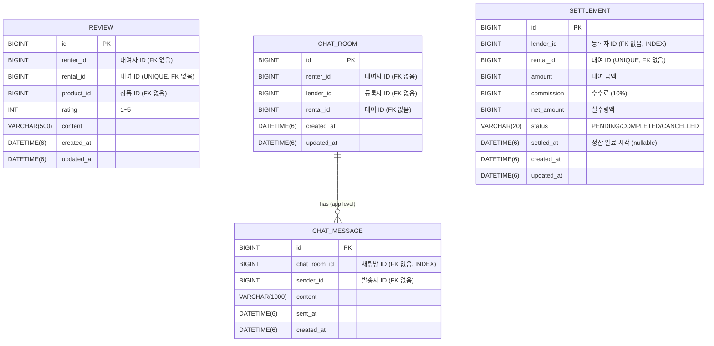

# TDD-003: Sprint 3 — 리뷰/채팅/관리자/정산 기술 설계

- **Status**: Draft v1.0
- **Date**: 2026-04-14
- **Related ADR**: ADR-007 (WebSocket 채팅 아키텍처), ADR-008 (정산 자동화 전략)
- **Sprint**: 3
- **Related PRD**: PRD-003-sprint3-review-chat-admin.md

---

## Background

Sprint 2에서 대여(Rental)/결제(Payment) 핵심 플로우가 완성되었다. Sprint 3은 플랫폼 신뢰도 강화를 위한 리뷰/평점, 실시간 채팅, 관리자 운영 대시보드, 자동 정산 총 4개 도메인을 추가한다.

- **review**: 대여 완료 후 신뢰 루프를 완성하는 평가 시스템
- **chat**: WebSocket(STOMP) 기반 실시간 1:1 채팅
- **admin**: 운영 효율화를 위한 통합 대시보드
- **settlement**: 등록자 수익 자동 정산 (수수료 10%)

각 도메인은 독립된 패키지로 격리하며, 도메인 간 참조는 ID(Long)만 허용한다.

---

## Terminology

| 용어 | 설명 |
|------|------|
| Review | 대여자가 반납 완료 후 작성하는 평가 Entity (Aggregate Root) |
| ReviewDomainService | 리뷰 생성/조회 비즈니스 로직 — 중복 검사, RETURNED 상태 검증 |
| ChatRoom | 대여 건(rentalId)에 연결된 1:1 채팅방 Entity |
| ChatMessage | 채팅방 내 단일 메시지 Entity |
| StompWebSocketConfig | Spring WebSocket STOMP 설정 — /ws/chat 엔드포인트 |
| Settlement | 대여 완료 후 자동 생성되는 등록자 정산 레코드 |
| SettlementDomainService | 정산 금액 계산 + 저장 (수수료 10% 차감) |
| AdminDomainService | 관리자 통계/목록 조회 서비스 |
| RentalReturnedEvent | 반납 완료 시 발행되는 Spring 도메인 이벤트 — 정산 트리거 |

---

## Define Problem

1. **리뷰 중복/무결성**: 같은 대여 건에 대한 중복 리뷰 방지 + RETURNED 상태가 아닌 경우 작성 차단
2. **WebSocket 세션 관리**: 다중 서버 환경에서의 채팅 메시지 전달 (단일 서버 MVP → Redis Pub/Sub 확장 고려)
3. **정산 멱등성**: RETURNED 이벤트 중복 처리 시 중복 정산 생성 방지 — DB UNIQUE INDEX + 예외 처리
4. **관리자 쿼리 성능**: 전체 대여/사용자 집계 쿼리 — QueryDSL + 인덱스 설계로 응답시간 보장
5. **도메인 격리**: review, chat, settlement 패키지는 rental 패키지를 직접 import할 수 없음 — 이벤트 기반 연동

---

## Possible Solutions

### WebSocket 아키텍처

| 방안 | 장점 | 단점 | 결정 |
|------|------|------|------|
| Spring WebSocket (STOMP) + in-memory | 구현 빠름, 의존성 최소 | 단일 서버 한계 — 스케일아웃 불가 | ✅ MVP 채택 |
| Spring WebSocket + Redis Pub/Sub | 멀티 인스턴스 지원 | Redis 의존성 추가, 설정 복잡 | Sprint 4 개선 목표 |
| SockJS + Long Polling fallback | 브라우저 호환성 | 성능 낮음 | 미채택 |
| 외부 채팅 서비스 (Firebase/Sendbird) | 빠른 도입 | 비용, 데이터 통제 불가 | 미채택 |

### 정산 자동화 방식

| 방안 | 장점 | 단점 | 결정 |
|------|------|------|------|
| RETURNED 이벤트 즉시 처리 (@TransactionalEventListener) | 실시간, 단순 구현 | 처리 실패 시 수동 재처리 필요 | ✅ MVP 채택 |
| 야간 배치 정산 | 일괄 처리, 재시도 용이 | 지연, 배치 인프라 필요 | Sprint 4 개선 |
| Outbox + CDC | 완전한 이벤트 정합성 | 높은 복잡도 | 미채택 (MVP 범위 초과) |

### 리뷰 중복 방지

| 방안 | 장점 | 단점 | 결정 |
|------|------|------|------|
| DB UNIQUE INDEX (rental_id) | 최종 방어선, 강력 | DB 에러 → 변환 필요 | ✅ 채택 |
| 애플리케이션 레벨 검사만 | 간단 | Race Condition 취약 | 단독 사용 불가 |
| Redis 분산 락 | Race Condition 완전 방지 | 인프라 복잡도 | 미채택 (MVP) |

---

## Detail Design

### 1. 기술 아키텍처

```
┌──────────────────────────────────────────────────────────────────┐
│                       Presentation Layer                         │
│  ReviewApiController · ChatApiController · AdminApiController    │
│  ChatWebSocketController (STOMP MessageMapping)                  │
│  (rental-api / rental-socket)                                    │
└────────────────────────────┬─────────────────────────────────────┘
                             │ UseCase 호출
┌────────────────────────────▼─────────────────────────────────────┐
│                       Application Layer                           │
│  CreateReviewUseCase · GetProductReviewsUseCase                  │
│  GetMyReviewsUseCase                                             │
│  CreateChatRoomUseCase · GetChatRoomsUseCase                     │
│  GetChatMessagesUseCase · SendChatMessageUseCase                 │
│  AdminDashboardQueryUseCase · AdminRentalListUseCase             │
│  AdminUserManagementUseCase                                      │
│  GetMySettlementsUseCase                                         │
└────────────────────────────┬─────────────────────────────────────┘
                             │ DomainService 호출
┌────────────────────────────▼─────────────────────────────────────┐
│                         Domain Layer                              │
│  ┌──────────────┐  ┌──────────────┐  ┌────────────────────────┐ │
│  │ review       │  │ chat         │  │ settlement             │ │
│  │ Review       │  │ ChatRoom     │  │ Settlement             │ │
│  │ ReviewDomain │  │ ChatMessage  │  │ SettlementDomainService │ │
│  │ Service      │  │ ChatDomain   │  │ SettlementRepository   │ │
│  │ ReviewRepo   │  │ Service      │  │ (interface)            │ │
│  │ (interface)  │  │ ChatRoomRepo │  └────────────────────────┘ │
│  └──────────────┘  │ ChatMsgRepo  │  ┌────────────────────────┐ │
│                    │ (interface)  │  │ admin                  │ │
│                    └──────────────┘  │ AdminDomainService     │ │
│                                      │ (쿼리 전담)            │ │
│                                      └────────────────────────┘ │
└────────────────────────────┬─────────────────────────────────────┘
                             │ Port 구현
┌────────────────────────────▼─────────────────────────────────────┐
│                      Infrastructure Layer                         │
│  ReviewRepositoryImpl (JPA + QueryDSL)                           │
│  ChatRoomRepositoryImpl · ChatMessageRepositoryImpl              │
│  SettlementRepositoryImpl                                        │
│  AdminQueryRepositoryImpl (QueryDSL 집계)                        │
│  StompWebSocketConfig (WebSocket 설정)                           │
└──────────────────────────────────────────────────────────────────┘
```

### 2. 도메인 패키지 구조

```
com.rental.commerce
├── domain
│   ├── review
│   │   ├── Review.kt                    (Entity / Aggregate Root)
│   │   ├── ReviewDomainService.kt
│   │   └── ReviewRepository.kt          (Port interface)
│   ├── chat
│   │   ├── ChatRoom.kt                  (Entity / Aggregate Root)
│   │   ├── ChatMessage.kt               (Entity)
│   │   ├── ChatDomainService.kt
│   │   ├── ChatRoomRepository.kt        (Port interface)
│   │   └── ChatMessageRepository.kt     (Port interface)
│   ├── settlement
│   │   ├── Settlement.kt                (Entity / Aggregate Root)
│   │   ├── SettlementStatus.kt          (Enum)
│   │   ├── SettlementDomainService.kt
│   │   └── SettlementRepository.kt      (Port interface)
│   └── admin
│       ├── AdminDomainService.kt
│       ├── DashboardSummary.kt          (Value Object)
│       └── AdminQueryRepository.kt      (Port interface)
├── application
│   ├── review
│   │   ├── CreateReviewUseCase.kt
│   │   ├── GetProductReviewsUseCase.kt
│   │   └── GetMyReviewsUseCase.kt
│   ├── chat
│   │   ├── CreateChatRoomUseCase.kt
│   │   ├── GetChatRoomsUseCase.kt
│   │   ├── GetChatMessagesUseCase.kt
│   │   └── SendChatMessageUseCase.kt
│   ├── settlement
│   │   └── GetMySettlementsUseCase.kt
│   └── admin
│       ├── AdminDashboardQueryUseCase.kt
│       ├── AdminRentalListUseCase.kt
│       └── AdminUserManagementUseCase.kt
├── presentation
│   ├── review
│   │   └── ReviewApiController.kt
│   ├── chat
│   │   ├── ChatApiController.kt
│   │   └── ChatWebSocketController.kt   (STOMP @MessageMapping)
│   ├── settlement
│   │   └── SettlementApiController.kt
│   └── admin
│       └── AdminApiController.kt
└── infrastructure
    ├── review
    │   ├── ReviewJpaRepository.kt
    │   ├── ReviewRepositoryImpl.kt
    │   └── ReviewQueryRepository.kt     (QueryDSL)
    ├── chat
    │   ├── ChatRoomJpaRepository.kt
    │   ├── ChatRoomRepositoryImpl.kt
    │   ├── ChatMessageJpaRepository.kt
    │   └── ChatMessageRepositoryImpl.kt
    ├── settlement
    │   ├── SettlementJpaRepository.kt
    │   └── SettlementRepositoryImpl.kt
    ├── admin
    │   └── AdminQueryRepositoryImpl.kt  (QueryDSL 집계)
    └── config
        └── StompWebSocketConfig.kt
```

### 3. 도메인 모델

#### 3.1 Review Entity

```kotlin
// domain/review/Review.kt
@Entity
@Table(name = "review", uniqueConstraints = [UniqueConstraint(columnNames = ["rental_id"])])
class Review(
    val renterId: Long,
    val rentalId: Long,
    val productId: Long,
    rating: Int,
    content: String,
) : BaseEntity() {

    var rating: Int = rating
        private set

    var content: String = content
        private set

    init {
        require(rating in 1..5) { "rating은 1~5 사이어야 합니다." }
        require(content.length in 10..500) { "리뷰 내용은 10~500자 사이어야 합니다." }
    }

    companion object {
        fun create(renterId: Long, rentalId: Long, productId: Long, rating: Int, content: String): Review {
            return Review(renterId, rentalId, productId, rating, content)
        }
    }
}
```

#### 3.2 ChatRoom & ChatMessage Entity

```kotlin
// domain/chat/ChatRoom.kt
@Entity
@Table(name = "chat_room")
class ChatRoom(
    val renterId: Long,
    val lenderId: Long,
    val rentalId: Long,
) : BaseEntity() {

    fun verifyParticipant(userId: Long) {
        if (renterId != userId && lenderId != userId) {
            throw ChatAccessDeniedException("채팅방 접근 권한이 없습니다.")
        }
    }
}

// domain/chat/ChatMessage.kt
@Entity
@Table(name = "chat_message")
class ChatMessage(
    val chatRoomId: Long,
    val senderId: Long,
    content: String,
    val sentAt: ZonedDateTime,
) : BaseEntity() {

    var content: String = content
        private set

    init {
        require(content.isNotBlank() && content.length <= 1000) { "메시지 내용은 1~1000자 사이어야 합니다." }
    }

    companion object {
        fun create(chatRoomId: Long, senderId: Long, content: String): ChatMessage {
            return ChatMessage(chatRoomId, senderId, content, ZonedDateTime.now())
        }
    }
}
```

#### 3.3 Settlement Entity

```kotlin
// domain/settlement/Settlement.kt
@Entity
@Table(name = "settlement", uniqueConstraints = [UniqueConstraint(columnNames = ["rental_id"])])
class Settlement(
    val lenderId: Long,
    val rentalId: Long,
    val amount: Long,
    val commission: Long,
    val netAmount: Long,
    status: SettlementStatus = SettlementStatus.PENDING,
) : BaseEntity() {

    var status: SettlementStatus = status
        private set

    var settledAt: ZonedDateTime? = null
        private set

    fun complete() {
        status.validateCanComplete()
        this.status = SettlementStatus.COMPLETED
        this.settledAt = ZonedDateTime.now()
    }

    companion object {
        private const val COMMISSION_RATE = 0.10

        fun create(lenderId: Long, rentalId: Long, amount: Long): Settlement {
            val commission = (amount * COMMISSION_RATE).toLong()
            val netAmount = amount - commission
            return Settlement(lenderId, rentalId, amount, commission, netAmount)
        }
    }
}

// domain/settlement/SettlementStatus.kt
enum class SettlementStatus {
    PENDING, COMPLETED, CANCELLED;

    fun validateCanComplete() {
        if (this != PENDING) throw SettlementAlreadyProcessedException("이미 처리된 정산입니다.")
    }
}
```

### 4. 상태 다이어그램

#### 4.1 Settlement 상태 전이



### 5. API 명세

#### 5.1 리뷰 API

| Method | URL | 설명 | 권한 |
|--------|-----|------|------|
| POST | /api/v1/reviews | 리뷰 작성 | 대여자 (RENTER) |
| GET | /api/v1/products/{productId}/reviews | 상품 리뷰 목록 조회 | 모든 사용자 |
| GET | /api/v1/my-reviews | 내 리뷰 목록 조회 | 본인 |

**POST /api/v1/reviews Request:**
```json
{
  "rentalId": 123,
  "productId": 456,
  "rating": 5,
  "content": "상태도 좋고 설명과 동일한 상품이었습니다."
}
```

**POST /api/v1/reviews Response (201):**
```json
{
  "reviewId": 789,
  "rentalId": 123,
  "productId": 456,
  "rating": 5,
  "content": "상태도 좋고 설명과 동일한 상품이었습니다.",
  "createdAt": "2026-04-14T10:00:00+09:00"
}
```

**GET /api/v1/products/{productId}/reviews Response (200):**
```json
{
  "averageRating": 4.3,
  "totalCount": 23,
  "reviews": [
    {
      "reviewId": 789,
      "renterNickname": "홍**",
      "rating": 5,
      "content": "상태도 좋고 설명과 동일한 상품이었습니다.",
      "createdAt": "2026-04-14T10:00:00+09:00"
    }
  ],
  "pageable": { "page": 0, "size": 10, "hasNext": true }
}
```

**에러 응답:**
| 상태코드 | 에러코드 | 설명 |
|---------|---------|------|
| 400 | REVIEW_INVALID_RATING | rating 값이 1~5 범위 외 |
| 400 | REVIEW_CONTENT_TOO_SHORT | content 10자 미만 |
| 403 | REVIEW_FORBIDDEN | 본인 대여가 아닌 경우 |
| 409 | REVIEW_ALREADY_EXISTS | 이미 리뷰 작성됨 |
| 422 | REVIEW_RENTAL_NOT_RETURNED | 대여 상태가 RETURNED가 아님 |

#### 5.2 채팅 API

| Method | URL | 설명 | 권한 |
|--------|-----|------|------|
| POST | /api/v1/chat-rooms | 채팅방 생성 | 대여자/등록자 |
| GET | /api/v1/chat-rooms | 내 채팅방 목록 | 본인 |
| GET | /api/v1/chat-rooms/{chatRoomId}/messages | 채팅 메시지 목록 | 채팅방 참여자 |

**POST /api/v1/chat-rooms Request:**
```json
{
  "rentalId": 123
}
```

**POST /api/v1/chat-rooms Response (201):**
```json
{
  "chatRoomId": 42,
  "rentalId": 123,
  "renterId": 1,
  "lenderId": 2,
  "createdAt": "2026-04-14T10:00:00+09:00"
}
```

**WebSocket STOMP 엔드포인트:**
```
CONNECT: /ws/chat?token={JWT}
SUBSCRIBE: /topic/chat/{chatRoomId}
SEND: /app/chat/{chatRoomId}/send
  payload: { "content": "메시지 내용" }
BROADCAST: /topic/chat/{chatRoomId}
  payload: { "chatMessageId": 1, "senderId": 1, "content": "...", "sentAt": "..." }
```

#### 5.3 관리자 API

| Method | URL | 설명 | 권한 |
|--------|-----|------|------|
| GET | /api/admin/dashboard | 운영 현황 요약 | ROLE_ADMIN |
| GET | /api/admin/rentals | 전체 대여 목록 (필터) | ROLE_ADMIN |
| GET | /api/admin/users | 전체 사용자 목록 | ROLE_ADMIN |
| PATCH | /api/admin/users/{userId}/suspend | 사용자 정지 | ROLE_ADMIN |
| PATCH | /api/admin/users/{userId}/unsuspend | 정지 해제 | ROLE_ADMIN |

**GET /api/admin/dashboard Response (200):**
```json
{
  "rentalStats": {
    "REQUESTED": 12,
    "APPROVED": 8,
    "PAID": 24,
    "IN_USE": 47,
    "RETURNED": 312,
    "CANCELLED": 15
  },
  "inspectPending": 5,
  "revenueSummary": {
    "todayRevenue": 320000,
    "weekRevenue": 1580000,
    "monthRevenue": 5240000
  }
}
```

#### 5.4 정산 API

| Method | URL | 설명 | 권한 |
|--------|-----|------|------|
| GET | /api/v1/my-settlements | 내 정산 내역 조회 | 등록자 (LENDER) |

**GET /api/v1/my-settlements Response (200):**
```json
{
  "totalNetAmount": 432000,
  "settlements": [
    {
      "settlementId": 1,
      "rentalId": 123,
      "productName": "캠핑 텐트 4인용",
      "amount": 50000,
      "commission": 5000,
      "netAmount": 45000,
      "status": "PENDING",
      "settledAt": null,
      "createdAt": "2026-04-13T22:00:00+09:00"
    }
  ],
  "pageable": { "page": 0, "size": 20, "hasNext": false }
}
```

---

## ERD



---

## DDL

```sql
-- review 테이블
CREATE TABLE review (
    id           BIGINT NOT NULL AUTO_INCREMENT COMMENT '리뷰 ID',
    renter_id    BIGINT NOT NULL               COMMENT '대여자 ID (application level ref)',
    rental_id    BIGINT NOT NULL               COMMENT '대여 ID (application level ref)',
    product_id   BIGINT NOT NULL               COMMENT '상품 ID (application level ref)',
    rating       INT NOT NULL                  COMMENT '평점 1~5',
    content      VARCHAR(500) NOT NULL         COMMENT '리뷰 내용 10~500자',
    created_at   DATETIME(6) NOT NULL          COMMENT '생성일시',
    updated_at   DATETIME(6) NOT NULL          COMMENT '수정일시',
    PRIMARY KEY (id),
    UNIQUE KEY uk_review_rental_id (rental_id),
    INDEX idx_review_product_id (product_id),
    INDEX idx_review_renter_id (renter_id)
) ENGINE=InnoDB DEFAULT CHARSET=utf8mb4 COMMENT='리뷰';

-- chat_room 테이블
CREATE TABLE chat_room (
    id           BIGINT NOT NULL AUTO_INCREMENT COMMENT '채팅방 ID',
    renter_id    BIGINT NOT NULL               COMMENT '대여자 ID (application level ref)',
    lender_id    BIGINT NOT NULL               COMMENT '등록자 ID (application level ref)',
    rental_id    BIGINT NOT NULL               COMMENT '대여 ID (application level ref)',
    created_at   DATETIME(6) NOT NULL          COMMENT '생성일시',
    updated_at   DATETIME(6) NOT NULL          COMMENT '수정일시',
    PRIMARY KEY (id),
    INDEX idx_chat_room_renter_id (renter_id),
    INDEX idx_chat_room_lender_id (lender_id),
    INDEX idx_chat_room_rental_id (rental_id)
) ENGINE=InnoDB DEFAULT CHARSET=utf8mb4 COMMENT='채팅방';

-- chat_message 테이블
CREATE TABLE chat_message (
    id           BIGINT NOT NULL AUTO_INCREMENT COMMENT '메시지 ID',
    chat_room_id BIGINT NOT NULL               COMMENT '채팅방 ID (application level ref)',
    sender_id    BIGINT NOT NULL               COMMENT '발송자 ID (application level ref)',
    content      VARCHAR(1000) NOT NULL        COMMENT '메시지 내용 1~1000자',
    sent_at      DATETIME(6) NOT NULL          COMMENT '발송일시',
    created_at   DATETIME(6) NOT NULL          COMMENT '생성일시',
    PRIMARY KEY (id),
    INDEX idx_chat_message_room_sent_at (chat_room_id, sent_at)
) ENGINE=InnoDB DEFAULT CHARSET=utf8mb4 COMMENT='채팅 메시지';

-- settlement 테이블
CREATE TABLE settlement (
    id           BIGINT NOT NULL AUTO_INCREMENT COMMENT '정산 ID',
    lender_id    BIGINT NOT NULL               COMMENT '등록자 ID (application level ref)',
    rental_id    BIGINT NOT NULL               COMMENT '대여 ID (application level ref)',
    amount       BIGINT NOT NULL               COMMENT '대여 금액 (원)',
    commission   BIGINT NOT NULL               COMMENT '플랫폼 수수료 (원, 10%)',
    net_amount   BIGINT NOT NULL               COMMENT '실수령액 = amount - commission',
    status       VARCHAR(20) NOT NULL          COMMENT 'PENDING/COMPLETED/CANCELLED',
    settled_at   DATETIME(6) NULL              COMMENT '정산 완료 일시',
    created_at   DATETIME(6) NOT NULL          COMMENT '생성일시',
    updated_at   DATETIME(6) NOT NULL          COMMENT '수정일시',
    PRIMARY KEY (id),
    UNIQUE KEY uk_settlement_rental_id (rental_id),
    INDEX idx_settlement_lender_id (lender_id),
    INDEX idx_settlement_status (status)
) ENGINE=InnoDB DEFAULT CHARSET=utf8mb4 COMMENT='정산';
```

---

## Security Information

| 항목 | 구현 방법 |
|------|---------|
| WebSocket 인증 | STOMP CONNECT 프레임에서 Authorization 헤더 또는 ?token= 쿼리 파라미터로 JWT 전달. ChannelInterceptor에서 토큰 검증 |
| 채팅방 접근 제어 | ChatRoom.verifyParticipant(userId) — renterId/lenderId 외 403 |
| 관리자 API | SecurityConfig에서 /api/admin/** → ROLE_ADMIN 설정 |
| 리뷰 내용 XSS | HtmlUtils.htmlEscape() 또는 OWASP AntiSamy 처리 |
| 정산 조회 | 요청자 userId == settlement.lenderId 검증 |

---

## Milestone

| 주차 | 티켓 | 담당 | 내용 |
|------|------|------|------|
| Week 1 | RC-301~304 | BE | 리뷰 도메인 — Entity, DomainService, UseCase, Controller, 통합테스트 |
| Week 1 | RC-309~312 | BE | 정산 도메인 — Entity, DomainService, 이벤트 리스너, UseCase, Controller |
| Week 2 | RC-305~308 | BE | 채팅 도메인 — Entity, WebSocket, UseCase, Controller |
| Week 2 | RC-313~316 | BE | 관리자 — Dashboard, AdminQuery, UserManagement |
| Week 2 | RC-317~319 | FE | 리뷰 UI — 작성 폼, 목록, 별점 컴포넌트 |
| Week 2 | RC-320~322 | FE | 정산 내역 UI |
| Week 3 | RC-323~327 | FE | 채팅 UI — 목록, 채팅방 (WebSocket 연동) |
| Week 3 | RC-328~330 | FE | 관리자 대시보드 UI |
| Week 3 | RC-331~332 | DevOps | Flyway 마이그레이션 + WebSocket 인프라 설정 |

---

## Testing Plan

### BE 테스트 레이어

#### Domain 단위 테스트 (Kotest BehaviorSpec)

| 테스트 대상 | 테스트 케이스 |
|------------|-------------|
| Review | rating=0 → IllegalArgumentException, rating=6 → exception, content 9자 → exception, content 501자 → exception, 정상 생성 검증 |
| Settlement.create() | amount=50000 → commission=5000, netAmount=45000 계산 검증 |
| Settlement.complete() | PENDING→COMPLETED 상태 전이 + settledAt 설정 검증 |
| Settlement.complete() | COMPLETED 상태에서 complete() 호출 → SettlementAlreadyProcessedException |
| ChatRoom.verifyParticipant() | renterId/lenderId 아닌 userId → ChatAccessDeniedException |
| SettlementStatus.validateCanComplete() | COMPLETED 상태 → 예외, PENDING → 정상 |

#### Application 단위 테스트 (MockK)

| 테스트 대상 | 테스트 케이스 |
|------------|-------------|
| CreateReviewUseCase | 정상 리뷰 생성 — reviewDomainService.createReview() 1회 호출 검증 |
| GetProductReviewsUseCase | productId 기반 리뷰 목록 반환 + 평균 평점 계산 |
| CreateChatRoomUseCase | 동일 rentalId 채팅방 이미 존재 시 기존 방 반환 검증 |
| GetMySettlementsUseCase | lenderId 기반 정산 목록 + totalNetAmount 합계 계산 |
| AdminDashboardQueryUseCase | 대여 상태별 카운트 + 매출 요약 반환 |

#### Infrastructure 통합 테스트 (TestContainers — MySQL)

| 테스트 대상 | 테스트 케이스 |
|------------|-------------|
| ReviewRepositoryImpl | rental_id UNIQUE 제약 위반 → DataIntegrityViolationException |
| ReviewQueryRepository | productId 기반 평균 평점 QueryDSL 집계 정확도 |
| SettlementRepositoryImpl | rental_id UNIQUE 제약 — 중복 저장 시 예외 |
| ChatMessageRepositoryImpl | chatRoomId + sentAt 복합 인덱스로 정렬 조회 성능 |
| AdminQueryRepositoryImpl | 대여 상태별 GROUP BY 카운트 쿼리 정확도 |

#### Presentation 통합 테스트 (@WebMvcTest + MockK)

| 테스트 대상 | 테스트 케이스 |
|------------|-------------|
| ReviewApiController | POST /api/v1/reviews — 201 반환, 필드 검증 실패 시 400 |
| ReviewApiController | GET /api/v1/products/{id}/reviews — 200 + 페이지네이션 |
| AdminApiController | /api/admin/** — ROLE_ADMIN 없으면 403 |
| AdminApiController | GET /api/admin/dashboard — 200 + DashboardResult 구조 |
| SettlementApiController | GET /api/v1/my-settlements — 200 + 정산 목록 |
| ChatApiController | POST /api/v1/chat-rooms — 201 + chatRoomId |

#### WebSocket 통합 테스트 (TestContainers + StompClient)

| 테스트 대상 | 테스트 케이스 |
|------------|-------------|
| ChatWebSocketController | CONNECT → SUBSCRIBE → SEND → BROADCAST 정상 플로우 |
| ChatWebSocketController | 채팅방 비참여자 SUBSCRIBE 시도 → 연결 거부 |
| StompWebSocketConfig | JWT 없는 CONNECT 시도 → 401 |

---

## Release Scenario

### 배포 순서 (의존성 기반)

1. **Flyway 마이그레이션** (RC-331) — review, chat_room, chat_message, settlement 테이블 생성
2. **BE 배포** (rental-api, rental-socket 모듈) — 새 도메인 엔드포인트 활성화
3. **FE 배포** (rental-web) — 리뷰/채팅/정산/어드민 UI 활성화
4. **기능 플래그**: 관리자 대시보드 → ROLE_ADMIN 계정만 접근 가능 (자연스러운 점진적 롤아웃)

### 롤백 플랜

| 상황 | 조치 |
|------|------|
| BE API 오류 | rental-api 이전 버전 이미지로 롤백, Flyway는 Undo 없음 → 신규 테이블 무해하게 유지 |
| WebSocket 오류 | rental-socket 모듈만 롤백, 채팅 기능 비활성화 (FE feature flag) |
| 정산 생성 실패 | 이벤트 미처리 건 수동 SQL로 정산 레코드 생성 (멱등성 보장 설계로 재실행 가능) |
| DB 마이그레이션 실패 | Flyway repair + 수동 DDL 롤백 (기존 테이블 무영향) |

---

## Project Information

| 항목 | 내용 |
|------|------|
| 모듈 | rental-domain, rental-application, rental-api, rental-socket, rental-infrastructure, rental-web |
| 신규 패키지 | domain.review, domain.chat, domain.settlement, domain.admin |
| Flyway 마이그레이션 | V3__review_chat_settlement.sql |
| 관련 ADR | ADR-007 (WebSocket 채팅 아키텍처), ADR-008 (정산 자동화 전략) |
| 관련 PRD | PRD-003-sprint3-review-chat-admin.md |
| GitHub Remote | https://github.com/biuea3866/rental-application.git |

---

## Document History

| 버전 | 날짜 | 작성자 | 내용 |
|------|------|-------|------|
| v1.0 | 2026-04-14 | Claude Agent | 최초 작성 — 리뷰/채팅/관리자/정산 Sprint 3 기술 설계 |
