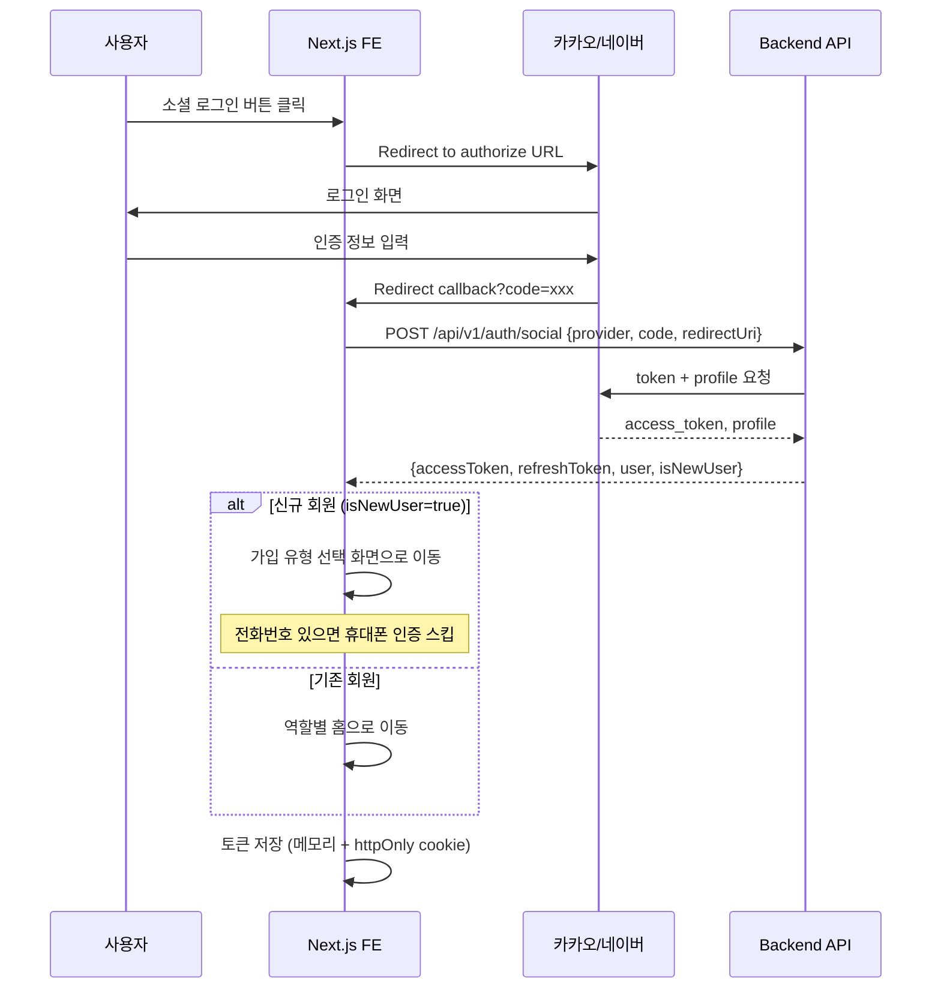
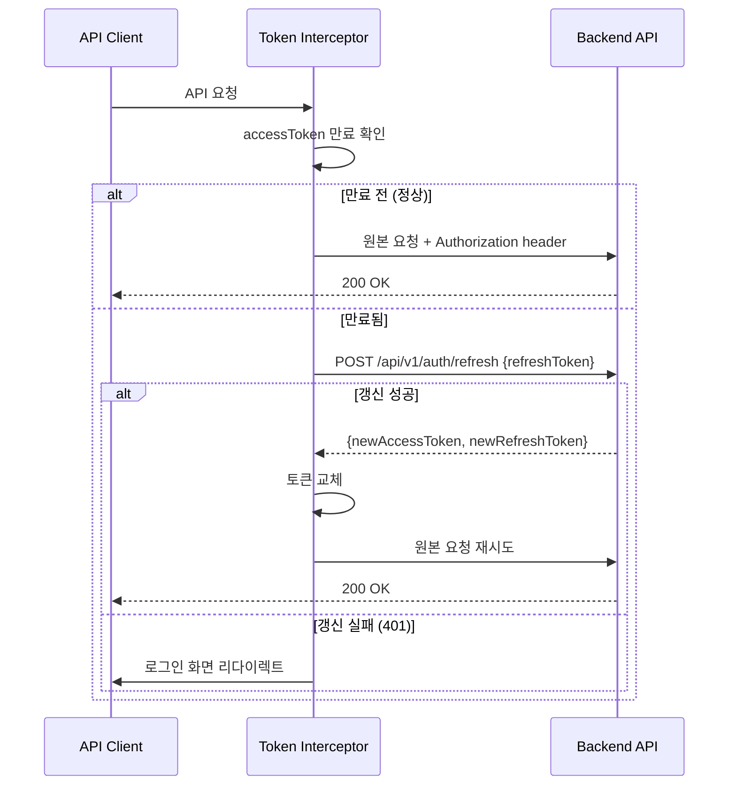
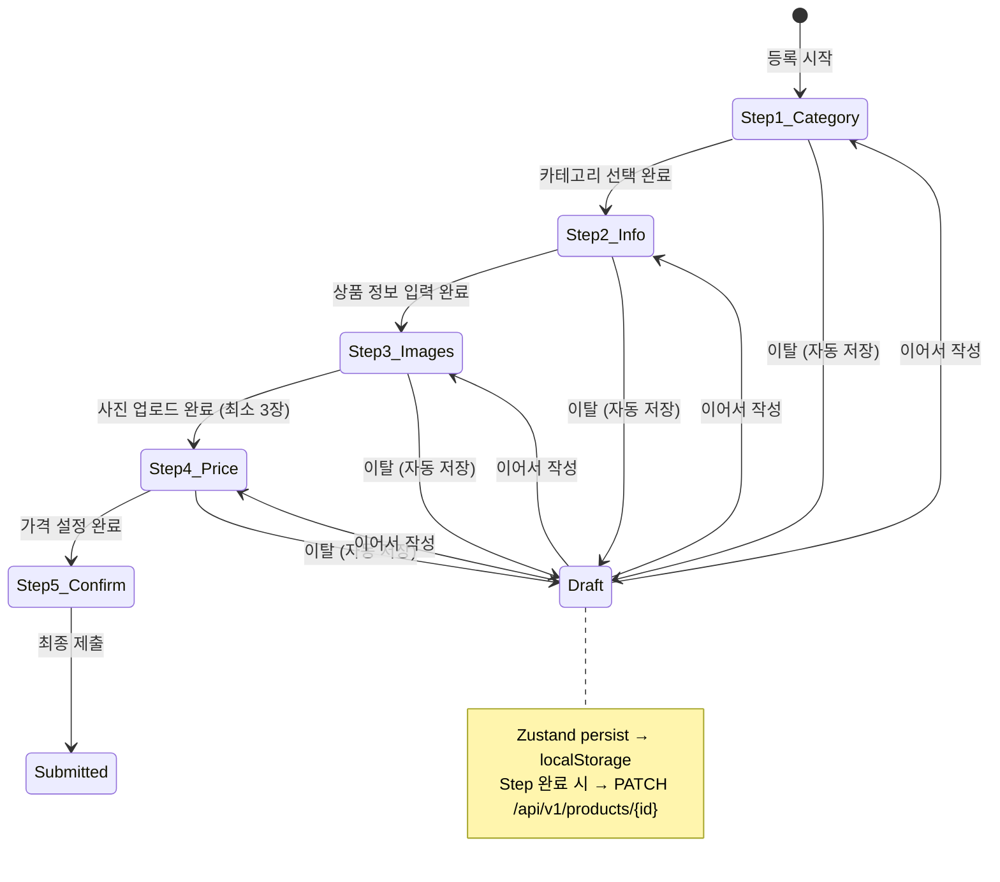
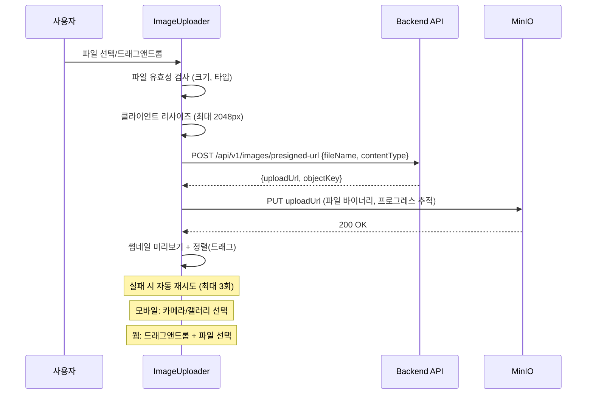
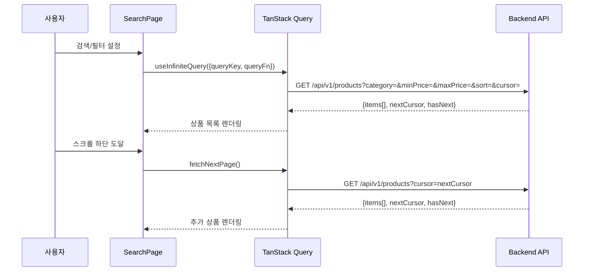
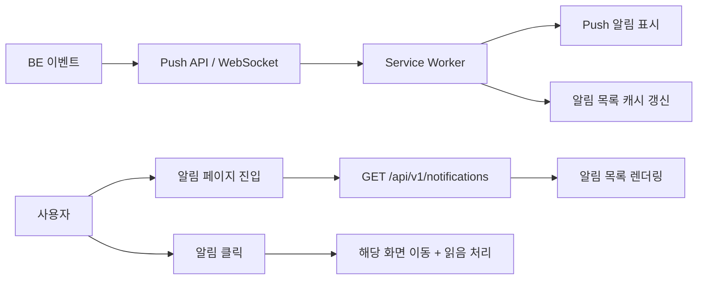

# TDD-FE-001: Sprint 1 — 회원 + 상품 FE 기술 설계

- **Status**: Draft v1.0
- **Date**: 2026-04-11
- **Related ADR**: ADR-FE-001, ADR-001, ADR-002
- **Related BE TDD**: TDD-001
- **Sprint**: 1

## Background

대여/구독 플랫폼의 FE를 Next.js 15 + PWA 스택으로 구축한다.
Sprint 1에서는 회원가입/로그인, 등록자/대여자 홈, 상품 등록(5단계 Draft), 상품 검색/상세, 마이페이지/알림, 관리자 검수 화면을 구현한다.
BE(Kotlin/Spring Boot)와 병렬 개발하며, OpenAPI codegen으로 API 계약을 동기화한다.

## Terminology

| 용어 | 설명 |
|------|------|
| Route Group | Next.js App Router의 `(folder)` 패턴, URL에 영향 없이 레이아웃/미들웨어 그룹화 |
| RSC | React Server Component — 서버에서 렌더링, 번들 크기 절감 |
| Draft Store | Zustand persist 스토어 — 상품 등록 폼 임시저장 상태 관리 |
| Presigned Upload | FE가 MinIO에 직접 PUT 요청으로 이미지 업로드 |
| Token Rotation | JWT Refresh Token 사용 시 새 토큰 발급 + 기존 폐기 |
| Infinite Query | TanStack Query의 무한 스크롤 쿼리 패턴 |

## Define Problem

1. 소셜 로그인(카카오/네이버) + 이메일 가입 + JWT Token Rotation 인증 흐름
2. 역할별 라우팅(등록자/대여자/관리자) + 인증 미들웨어
3. 상품 등록 5단계 다단계 폼 + Draft 자동 저장 + 이탈 방지
4. Presigned URL 이미지 업로드 (FE -> MinIO 직접)
5. 상품 검색/목록(필터, 정렬, 무한 스크롤) + 상품 상세(플랫폼별 분기)
6. 마이페이지, 알림 목록, 등록 상품 관리
7. 관리자 검수 대기/상세 화면

## Possible Solutions

### 소셜 로그인 흐름

| 방안 | 장점 | 단점 | 결정 |
|------|------|------|------|
| NextAuth.js (Auth.js v5) | 다양한 Provider 내장, 세션 관리 자동 | 커스텀 JWT 관리 복잡, BE 통합 어려움 | 미채택 |
| 직접 구현 (OAuth2 Redirect) | BE JWT와 완전 통합, 자유로운 제어 | 구현량 많음 | **채택** |

- FE에서 카카오/네이버 OAuth2 Authorize URL로 리다이렉트
- 콜백에서 authorization_code를 BE에 전달
- BE가 Provider에서 프로필 획득 → JWT 발급 → FE에 전달
- FE는 httpOnly 쿠키 또는 메모리+localStorage 하이브리드로 토큰 관리

### 다단계 폼 상태 관리

| 방안 | 장점 | 단점 | 결정 |
|------|------|------|------|
| React Hook Form + Zustand persist | 폼 유효성 + 상태 유지 분리 | 두 라이브러리 통합 | **채택** |
| React Hook Form만 | 단순 | 브라우저 이탈 시 상태 소실 | 미채택 |
| 서버 Draft만 | 단일 소스 | 네트워크 의존, 느림 | 미채택 |

- React Hook Form: step별 폼 유효성 검증, 자동 포커스, 에러 메시지
- Zustand persist: localStorage에 Draft 상태 자동 저장, 새로고침/이탈 후 복원
- 서버 동기화: step 완료 시 `PATCH /api/v1/products/{id}` (status=DRAFT)로 BE 동기화

### 이미지 업로드 UX

| 방안 | 장점 | 단점 | 결정 |
|------|------|------|------|
| FE → MinIO 직접 (Presigned) | BE 부하 없음, 대용량 지원 | CORS, 프로그레스 관리 필요 | **채택** |
| FE → BE → MinIO | 간단 | BE 병목, 대용량 제한 | 미채택 |

### 상품 목록 페이징

| 방안 | 장점 | 단점 | 결정 |
|------|------|------|------|
| Cursor 기반 무한 스크롤 | UX 자연스러움, 실시간 데이터 안정 | 페이지 번호 이동 불가 | **채택** |
| Offset 기반 페이지네이션 | 페이지 이동 가능 | 데이터 변동 시 중복/누락 | 미채택 |

## Detail Design

### 전체 화면 흐름

```mermaid
flowchart TD
    A[스플래시 /] --> B{인증 상태?}
    B -->|미인증| C[로그인 /(auth)/login]
    B -->|인증됨| D{유저 역할?}
    
    C --> E[이메일 로그인]
    C --> F[소셜 로그인 카카오/네이버]
    C --> G[가입 유형 선택 /(auth)/signup]
    
    G -->|등록자| H[등록자 가입 /(auth)/signup/lender]
    G -->|대여자| I[대여자 가입 /(auth)/signup/renter]
    
    H --> J[휴대폰 인증] --> K[정산 계좌 등록]
    I --> L[휴대폰 인증] --> M[결제 수단 등록]
    
    D -->|LENDER| N[등록자 홈 /(lender)/dashboard]
    D -->|RENTER| O[대여자 홈 /(renter)/home]
    D -->|ADMIN| P[검수 대기 /(admin)/inspection]
    
    N --> Q[상품 등록 /(lender)/products/new]
    N --> R[등록 상품 관리 /(lender)/products]
    N --> S[마이페이지 /(common)/mypage]
    N --> T[알림 /(common)/notifications]
    
    O --> U[상품 검색 /(renter)/search]
    O --> V[상품 상세 /(renter)/products/:id]
    O --> S
    O --> T
    
    P --> W[검수 상세 /(admin)/inspection/:id]
```

### 소셜 로그인 + JWT Sequence



### JWT Token Rotation (자동 갱신)



### 상품 등록 5단계 폼 설계



#### Step별 상세

| Step | 화면 | 입력 필드 | 유효성 검증 | API 호출 |
|------|------|----------|------------|----------|
| 1 | 카테고리 선택 | categoryCode (트리 구조) | 필수 선택 | POST /api/v1/products (DRAFT 생성) |
| 2 | 상품 정보 | name, description, condition | name 2~50자, description 10~2000자 | PATCH /api/v1/products/{id} |
| 3 | 사진 업로드 | images[] (Presigned URL) | 최소 3장, 최대 10장, 각 10MB 이하 | POST /api/v1/images/presigned-url → PUT MinIO |
| 4 | 가격 설정 | rentalUnit, price, deposit | 가격 > 0, 가이드 가격 범위 표시 | PATCH /api/v1/products/{id} |
| 5 | 최종 확인 | (읽기 전용 요약) | 전체 필드 완성 확인 | POST /api/v1/products/{id}/submit |

#### 이미지 업로드 컴포넌트 설계



### 상품 검색/목록 (무한 스크롤)



### 플랫폼별 컴포넌트 분기

```typescript
// hooks/useMediaQuery.ts
const useIsMobile = () => useMediaQuery('(max-width: 768px)');

// 사진 갤러리
// 모바일: <SwipeGallery> — 좌우 스와이프 + 인디케이터
// 웹: <GridGallery> — 썸네일 그리드 + 메인 이미지

// 가격 계산기
// 모바일: <BottomSheet> — 기간 선택 → 비용 계산
// 웹: <SidePanel> — 항상 노출

// 사진 업로드
// 모바일: 카메라/갤러리 선택 (input capture)
// 웹: 드래그앤드롭 + 파일 선택

// 상품 등록
// 모바일: 단계별 풀스크린
// 웹: 좌우 분할 (입력 + 미리보기)
```

### 컴포넌트 트리

```
src/components/
├── ui/                          # shadcn/ui 기본 컴포넌트
│   ├── button.tsx
│   ├── input.tsx
│   ├── dialog.tsx
│   ├── sheet.tsx               # 바텀시트/사이드패널
│   ├── tabs.tsx
│   ├── select.tsx
│   ├── toast.tsx
│   └── ...
├── layout/
│   ├── AppHeader.tsx           # 역할별 헤더
│   ├── BottomNav.tsx           # 모바일 하단 내비게이션
│   ├── SideNav.tsx             # 웹 사이드 내비게이션
│   └── AuthGuard.tsx           # 인증 가드 (미들웨어 보조)
├── auth/
│   ├── LoginForm.tsx           # 이메일 로그인 폼
│   ├── SocialLoginButtons.tsx  # 카카오/네이버 소셜 로그인
│   ├── PhoneVerification.tsx   # 휴대폰 인증 (타이머 + 재발송)
│   ├── SignupTypeSelector.tsx  # 등록자/대여자 선택
│   └── SignupForm.tsx          # 가입 공통 폼
├── product/
│   ├── ProductCard.tsx         # 상품 카드 (목록용)
│   ├── ProductGrid.tsx         # 상품 그리드 (반응형)
│   ├── ProductDetail.tsx       # 상품 상세 정보
│   ├── ImageGallery/
│   │   ├── SwipeGallery.tsx    # 모바일 스와이프
│   │   └── GridGallery.tsx     # 웹 그리드
│   ├── PriceCalculator/
│   │   ├── BottomSheetCalc.tsx # 모바일 바텀시트
│   │   └── SidePanelCalc.tsx   # 웹 사이드패널
│   ├── ImageUploader.tsx       # 이미지 업로드 (Presigned)
│   ├── ProductForm/
│   │   ├── StepIndicator.tsx   # 단계 표시기
│   │   ├── CategoryStep.tsx    # Step 1
│   │   ├── InfoStep.tsx        # Step 2
│   │   ├── ImageStep.tsx       # Step 3
│   │   ├── PriceStep.tsx       # Step 4 (가이드 가격 표시)
│   │   └── ConfirmStep.tsx     # Step 5
│   ├── ProductList.tsx         # 등록 상품 관리 목록
│   └── InspectionResult.tsx    # 검수 결과 (승인/반려)
├── search/
│   ├── SearchBar.tsx           # 검색 입력
│   ├── FilterPanel.tsx         # 카테고리/가격/단위 필터
│   └── SortSelector.tsx        # 정렬 선택
├── notification/
│   └── NotificationItem.tsx    # 알림 아이템
└── mypage/
    ├── ProfileView.tsx         # 프로필 조회
    └── ProfileEditForm.tsx     # 프로필 수정
```

### Zustand 스토어 설계

```typescript
// stores/authStore.ts — 인증 상태
interface AuthStore {
  user: User | null;
  accessToken: string | null;
  isAuthenticated: boolean;
  login: (tokens: TokenPair, user: User) => void;
  logout: () => void;
  updateTokens: (tokens: TokenPair) => void;
}

// stores/productDraftStore.ts — 상품 등록 Draft
interface ProductDraftStore {
  draftId: string | null;
  currentStep: number; // 1~5
  formData: {
    categoryCode: string | null;
    name: string;
    description: string;
    condition: string | null;
    images: UploadedImage[];
    rentalUnit: RentalUnit | null;
    price: number | null;
    deposit: number | null;
  };
  setStep: (step: number) => void;
  updateFormData: (partial: Partial<FormData>) => void;
  addImage: (image: UploadedImage) => void;
  removeImage: (objectKey: string) => void;
  reorderImages: (from: number, to: number) => void;
  reset: () => void;
}
// persist: localStorage, key: 'product-draft'

// stores/searchStore.ts — 검색 필터 상태
interface SearchStore {
  filters: {
    category: string | null;
    minPrice: number | null;
    maxPrice: number | null;
    rentalUnit: RentalUnit | null;
    sort: 'popular' | 'price_asc' | 'price_desc' | 'newest';
  };
  setFilter: (key: string, value: any) => void;
  resetFilters: () => void;
}
```

### TanStack Query 키 설계

```typescript
// lib/queryKeys.ts
export const queryKeys = {
  auth: {
    me: ['auth', 'me'] as const,
  },
  products: {
    all: ['products'] as const,
    list: (filters: ProductFilters) => ['products', 'list', filters] as const,
    detail: (id: string) => ['products', 'detail', id] as const,
    myProducts: (status?: string) => ['products', 'my', status] as const,
    priceGuide: (category: string, unit: string) => ['products', 'priceGuide', category, unit] as const,
  },
  inspection: {
    pending: ['inspection', 'pending'] as const,
    detail: (id: string) => ['inspection', 'detail', id] as const,
  },
  notifications: {
    list: ['notifications'] as const,
    unreadCount: ['notifications', 'unread'] as const,
  },
} as const;
```

### API 클라이언트 구조

```typescript
// lib/api/client.ts
class ApiClient {
  private baseUrl: string;
  
  async fetch<T>(endpoint: string, options?: RequestInit): Promise<T> {
    // 1. accessToken 첨부
    // 2. 요청 실행
    // 3. 401 시 Token Rotation 시도
    // 4. 갱신 성공 시 원본 요청 재시도
    // 5. 갱신 실패 시 로그아웃 + 로그인 리다이렉트
    // 6. 에러 핸들링 (ErrorResponse → toast)
  }
}
```

### 인증 미들웨어

```typescript
// middleware.ts (Next.js Middleware)
// 1. 토큰 존재 여부 확인 (cookie)
// 2. /auth/* 경로: 인증되었으면 홈으로 리다이렉트
// 3. /lender/* 경로: LENDER/BOTH 역할 확인
// 4. /renter/* 경로: RENTER/BOTH 역할 확인
// 5. /admin/* 경로: ADMIN 역할 확인
// 6. 미인증 시 /auth/login으로 리다이렉트
```

### 알림 시스템



## Testing Plan

### 단위 테스트 (Vitest)

| 대상 | 테스트 항목 |
|------|------------|
| authStore | login/logout 상태 변경, token 업데이트, 초기 상태 |
| productDraftStore | step 이동, formData 업데이트, 이미지 추가/삭제/정렬, persist 복원, reset |
| searchStore | 필터 설정/초기화 |
| Token Interceptor | 만료 토큰 자동 갱신, 갱신 실패 시 로그아웃, 동시 요청 큐잉 |
| 유틸리티 | 가격 포맷, 날짜 포맷, 유효성 검증 함수 |

### 컴포넌트 테스트 (React Testing Library)

| 컴포넌트 | 테스트 항목 |
|----------|------------|
| LoginForm | 이메일/비밀번호 입력, 유효성 에러 표시, 제출, 로딩 상태 |
| SocialLoginButtons | 카카오/네이버 버튼 렌더링, 클릭 시 OAuth URL 이동 |
| PhoneVerification | 인증번호 입력, 타이머 표시, 재발송, 인증 완료 |
| ProductForm (StepIndicator) | 현재 step 강조, 완료 step 체크, 클릭 이동 |
| CategoryStep | 카테고리 트리 렌더링, 선택, 다음 버튼 활성화 |
| ImageUploader | 파일 드롭, 미리보기, 삭제, 드래그 정렬, 최소/최대 장수 검증 |
| PriceStep | 가격 입력, 가이드 가격 범위 표시, 보증금 토글 |
| ProductCard | 상품 정보 렌더링, 클릭 이동 |
| FilterPanel | 필터 토글, 선택, 초기화 |
| SwipeGallery | 좌우 스와이프, 인디케이터 |
| GridGallery | 썸네일 클릭, 메인 이미지 변경 |
| NotificationItem | 읽음/안읽음 스타일, 클릭 시 이동 |

### E2E 테스트 (Playwright)

| 시나리오 | 흐름 |
|----------|------|
| 이메일 가입 → 등록자 | 가입 유형 선택 → 정보 입력 → 휴대폰 인증 → 정산 계좌 → 등록자 홈 도달 |
| 이메일 가입 → 대여자 | 가입 유형 선택 → 정보 입력 → 휴대폰 인증 → 결제 수단 → 대여자 홈 도달 |
| 소셜 로그인 (카카오) | 카카오 버튼 → OAuth 리다이렉트 → 콜백 → 홈 도달 |
| 상품 등록 (완료) | Step1~5 순차 진행 → 각 Step 유효성 → 최종 제출 → 검수 대기 |
| 상품 등록 (Draft 복원) | Step2까지 진행 → 페이지 이탈 → 재진입 → Step2부터 이어서 |
| 이미지 업로드 | 파일 선택 → 업로드 프로그레스 → 미리보기 → 드래그 정렬 |
| 상품 검색/필터 | 카테고리 선택 → 가격 범위 → 정렬 → 무한 스크롤 → 상품 상세 이동 |
| 관리자 검수 | 검수 대기 목록 → 상세 → 승인/반려 → 목록 업데이트 |
| 마이페이지 | 프로필 조회 → 수정 → 저장 → 반영 확인 |
| JWT 자동 갱신 | 토큰 만료 → API 요청 → 자동 갱신 → 정상 응답 |

### Edge Case 테스트

| 항목 | 시나리오 |
|------|----------|
| 네트워크 오프라인 | 오프라인 시 PWA 캐시 페이지 표시, 온라인 복귀 시 자동 동기화 |
| 대용량 이미지 | 10MB 초과 파일 업로드 시 에러 메시지, 클라이언트 리사이즈 동작 |
| 동시 토큰 갱신 | 여러 API가 동시에 401 → 단일 갱신 요청 + 큐잉 |
| 소셜 로그인 취소 | OAuth 화면에서 취소 → 에러 처리 + 로그인 화면 복귀 |
| Draft 만료 | 7일 이상 미완성 Draft → 서버 만료 → FE 안내 + localStorage 정리 |
| 이미지 업로드 실패 | Presigned URL 만료/네트워크 오류 → 자동 재시도(3회) → 실패 시 안내 |

## Performance Targets

| 지표 | 목표 |
|------|------|
| FCP (First Contentful Paint) | < 1.5s |
| LCP (Largest Contentful Paint) | < 2.5s |
| CLS (Cumulative Layout Shift) | < 0.1 |
| TTI (Time to Interactive) | < 3.0s |
| 이미지 업로드 (5MB) | < 3s (Presigned URL) |
| 검색 결과 렌더링 | < 200ms (캐시 히트) |

## Milestone

| 순서 | 작업 (FE 티켓) | 규모 | 의존성 |
|------|---------------|------|--------|
| 1 | RC-FE-001: 프로젝트 초기 설정 (Next.js, Tailwind, shadcn, PWA, 인증 공통) | L | 없음 |
| 2 | RC-FE-002: 회원가입/로그인 (소셜, 휴대폰 인증, JWT) | L | RC-FE-001, BE Auth API |
| 3 | RC-FE-003: 등록자 홈 + 상품 등록 (5단계 폼, Presigned 업로드) | XL | RC-FE-002, BE Product API |
| 4 | RC-FE-004: 대여자 홈 + 검색/목록/상세 | L | RC-FE-002, BE Product API |
| 5 | RC-FE-005: 마이페이지 + 알림 + 상품 관리 | M | RC-FE-002 |

## Document History

| 날짜 | 버전 | 변경 내용 |
|------|------|----------|
| 2026-04-11 | 1.0 | 초안 작성 — Sprint 1 FE 기술 설계 |
